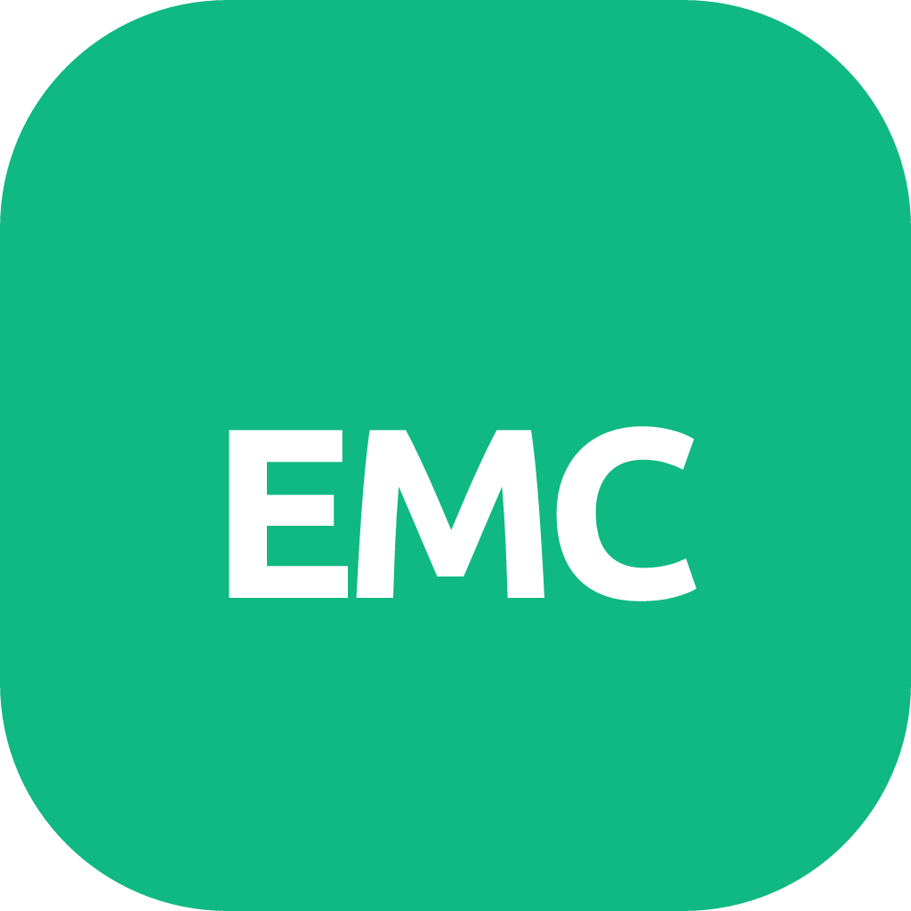

  

<h1 align="center">eMatChef<small>v4.01</small></h1>

  
  
  
   
  
  
  
  
  

eMatChef ist ein Tool zur Materialverwaltung und Vermietung von Material.
Es unterstützt den Bestand, Bewegungen und Rollenrechte in einem Vue-Frontend mit Symfony-Backend.

### Wie kann ich helfen?

Vielen Dank für Ihre Unterstützung! Es gibt verschiedene Möglichkeiten, mitzumachen.

- Besuchen Sie unsere Testumgebung unter [https://dev.ematchef.ch](https://dev.ematchef.ch). Sollten Sie einen Fehler entdecken, [eröffnen Sie bitte ein neues Issue](https://github.com/eMatChef/eMatChef1/issues/new).

- Um uns bei der Übersetzung von eMatChef in weitere Sprachen zu unterstützen, nutzen Sie bitte unser [Übersetzungstool](https://translate.ematchef.ch).

Um das Projekt lokal auf Ihrem Computer auszuführen, folgen Sie einer der Installationsanleitungen:

[Installation mit Docker unter Linux](https://github.com/eMatChef/eMatChef1/wiki/Development-install-on-linux)

[Installation mit Docker unter Windows + WSL2](https://github.com/eMatChef/eMatChef1/wiki/Development-installation-on-Windows)

[VS Code als Code-Editor einrichten](https://github.com/eMatChef/eMatChef1/wiki/Development-installation-on-Windows#setting-up-the-ide)

Sollten Sie bei der Einrichtung auf Probleme stoßen oder Fragen haben, keine Sorge, wir helfen Ihnen gerne weiter. Sie können auf unserem [Community-Discord-Server](https://discord.gg/cwfxNEDq) um Hilfe bitten. Wir unterstützen Sie bestmöglich bei der Einrichtung und dem Start.

Bevor Sie mit dem Programmieren beginnen, lesen Sie bitte unsere [Richtlinien für Mitwirkende](CONTRIBUTING.md).

- Machen Sie sich mit der [Dokumentation im Wiki](https://github.com/eMatChef/eMatChef1/wiki) vertraut.
- Wählen Sie ein [Problem mit der Bezeichnung „gutes erstes Problem“](https://github.com/eMatChef/eMatChef1/issues) und versuchen Sie, es zu lösen.
