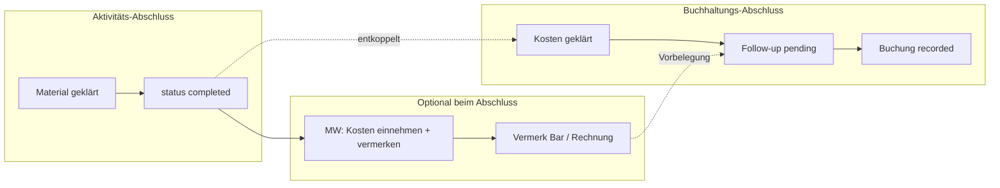
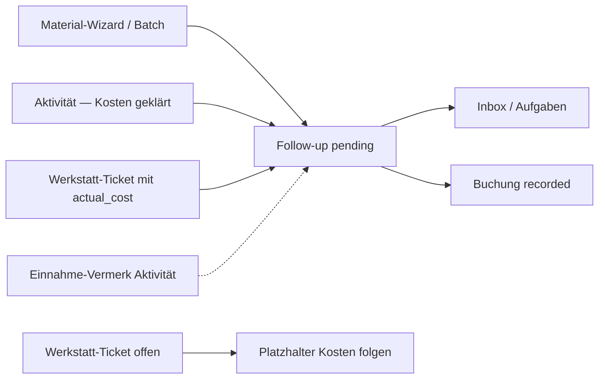
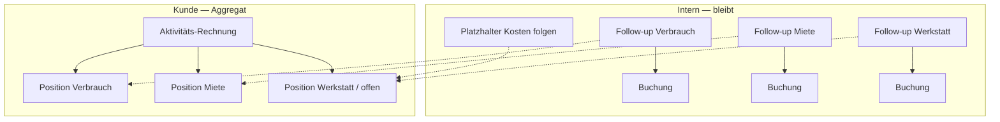

# Buchhaltung (eMatChef)

Unterstützende Kostenverwaltung für Material-Departments — **kein Ersatz** für das Vereins-Finanztool (Abacus, Bexio, Excel beim Kassier).

**Stand Spec:** August 2026 · Feature Top-10 #7 — **Phasen 1–6 erledigt**. **Aktivitäts-Rechnung v1** (berechnet) umgesetzt; PDF/Persistenz später.

## Positionierung

| eMatChef Buchhaltung | Vereins-Finanztool |
| --- | --- |
| Materialbezogene Ausgaben erfassen & strukturieren | Vollständige Buchhaltung |
| Kostenstellen, Budget-Soll, Ist-Auswertungen | Kontenplan, Soll/Haben |
| CHF, keine MwSt. | MwSt., QR-Rechnung, OP-Liste |
| Export CSV für Abgleich | Revision, Bankabgleich |

## Zugriff

| Rolle | Zugriff |
| --- | --- |
| Materialwart (MW), Depchef (DC) | Vollzugriff: alle Tabs; Einnahme-Vermerk in Aktivität |
| Leiter 1–3 (L1–L3) | Lesesicht **Gruppenkosten** |
| Gruppenchef (Rolle `user` + Gruppenleitung) | Lesesicht **Gruppenkosten**, nur eigene Gruppen |

API-Schutz: `AccountingMwOrDcTrait` (Schreiben) bzw. `assertAccountingGroupReportAccess` (Gruppen-Report).

---

## Zwei Abschlüsse (Kernmodell)

**Aktivitäts-Abschluss** und **Buchhaltungs-Abschluss** sind entkoppelt. Keiner blockiert den anderen.

| | Aktivität abschliessen | Buchhaltung abschliessen |
| --- | --- | --- |
| Frage | Ist jedes Material physisch geklärt? | Sind entstandene Kosten verrechnet? |
| Fertig wenn | siehe [Aktivitäts-Abschluss](#aktivitäts-abschluss-material) | alle relevanten Kosten geklärt + in `/accounting` gebucht |
| Ort | Aktivitäts-Status → `completed` | Modul Buchhaltung (Follow-ups → Buchungen) |



### Aktivitäts-Abschluss (Material)

Jedes Stück / jede offene Menge ist geklärt, wenn **eine** der folgenden Bedingungen gilt:

| Disposition | Bedeutung |
| --- | --- |
| **Eingelagert** | `quantity_stored` (Retour → Lager) |
| **In der Werkstatt** | Verlust/Reparatur/Schaden **gemeldet** und dem Werkstatt-Pfad zugeordnet (Ticket angelegt oder gleichwertig) |
| **Verlust gemeldet** | Issue `loss` gemeldet — für den Aktivitäts-Abschluss reicht die Meldung |

**Nicht nötig für `completed`:**

- fertig bearbeitetes Werkstatt-Ticket / `actual_cost`
- ausstehende Buchhaltungs-Follow-ups
- Einnahme oder Vermerk in der Aktivität

**Ist-Code (Stand Phase 1):** `completed` wird nur noch durch fehlende Material-Disposition blockiert (`unstored_pack_items`). Offene Werkstatt-Tickets und `pending_accounting_followups` sind Hinweise, keine Blocker. Siehe [activities/status.md](./activities/status.md), [material-pipeline.md](./activities/material-pipeline.md).

### Buchhaltungs-Abschluss (Kosten)

Effektive Abrechnung geschieht **nur in der Buchhaltung** (`/accounting`): Follow-up zuordnen → `AccountingBooking` (Kostenstelle, Zahlungsart, Status, Beleg).

Voraussetzungen, damit Kosten einer Aktivität / externen Miete verrechenbar sind:

| Kostenart | Wann «geklärt» |
| --- | --- |
| Verbrauch | Mengen/Preise aus Aktivität (Tab Kosten) |
| Externe Miete (`activity_rental`) | Positionen / Beträge gesetzt |
| Werkstatt / Reparatur / Verlust mit Wert | Meldung **bearbeitet**, effektive Kosten bekannt (`actual_cost` o. ä.) |
| Nachkauf | Nachlieferungs-Positionen mit Kaufpreis |

Ohne geklärte Werkstatt-/Verlust-Kosten: Follow-up noch nicht final verrechnen bzw. Betrag 0 / ausstehend — Aktivität darf trotzdem schon `completed` sein.

### Buchhaltung: «Kosten folgen» (offene Werkstatt)

**Ist:** Offene Werkstatt-Tickets mit Aktivitätsbezug erscheinen in `/accounting` als Platzhalter «Kosten folgen» (kein Betrag/Buchung). Echte Follow-ups `activity_workshop` weiterhin erst nach Ticket-Abschluss mit `actual_cost > 0`.

**Ziel:** In der Buchhaltung sichtbar machen, dass zu einer Aktivität noch **Werkstatt-Einträge offen** sind und **Kosten folgen** werden — ohne schon eine Buchung anzulegen.

| Ort (Ziel) | Anzeige |
| --- | --- |
| Übersicht `/accounting` | KPI oder Hinweis: «n Aktivitäten / Tickets mit ausstehenden Werkstatt-Kosten» |
| Buchungen → Zuordnen / Pending-Liste | Neben echten `pending`-Follow-ups: **Platzhalter-Zeilen** «Werkstatt offen — Kosten folgen» (pro Ticket oder aggregiert pro Aktivität) |
| Optional Aufgaben / Inbox | gleiche Info, Link zur Werkstatt bzw. Aktivität |

**Platzhalter-Inhalt (Minimum):**

- Aktivität (Name + Link)
- Anzahl offener Tickets **oder** Ticket-Titel / Material
- Status-Hinweis: z. B. `open` / `in_progress` / `waiting_parts`
- Label **«Kosten folgen»** — kein Betrag (oder nur `estimated_cost`, wenn gesetzt, klar als Schätzung)
- CTA: Link Werkstatt-Ticket / Aktivität Tab Kosten

**Regeln:**

- Kein `AccountingBooking`, kein verrechenbarer Betrag — nur **Erwartung**.
- Sobald Ticket `completed` + `actual_cost` → Platzhalter verschwindet, echtes Follow-up `activity_workshop` erscheint (wie heute).
- Ticket `cancelled` / ohne Kostenrelevanz → Platzhalter weg, kein Follow-up.
- MW/DC wie übrige Buchhaltung; keine Schreibaktion «zuordnen» auf dem Platzhalter.

**API:** `GET …/accounting/expected-costs` mit Einträgen `{ kind: 'workshop_open', activity_id, ticket_id, … }`. Übersicht enthält `expected_workshop_open_count` / `expected_workshop_activity_count`.

### Einnahme-Vermerk in der Aktivität (kein Ersatz für Buchhaltung)

Beim Aktivitäts-Abschluss (Tab **Kosten** / Abschluss-UI) kann der **MW/DC** entstandene Kosten **gerade einnehmen** und das als **Vermerk / Position** festhalten:

| Aktion in Aktivität | Bedeutung |
| --- | --- |
| **Bar** (einnehmen) | Betrag bar kassiert — Vermerk «Bar eingenommen» |
| **Rechnung** | Wird / wurde in Rechnung gestellt — Vermerk «Rechnung», typisch noch offen |
| *(kein Vermerk)* | Nichts eingenommen; alles bleibt für die Buchhaltung offen |

**Regeln:**

- Der Vermerk ist ein **Betriebsvermerk**, **keine** fertige Buchung (keine Kostenstelle, kein `AccountingBooking` allein dadurch).
- In der Buchhaltung erscheint der Vermerk als **Vorbelegung** beim Zuordnen (z. B. `payment_method = cash_group`, `payment_status = paid` bei Bar-Einnahme).
- Die **effektive Abrechnung** bleibt immer der Schritt Follow-up → Buchung in `/accounting`.
- Default-Verhalten: Vermerk **optional**; ohne Vermerk → Verrechnung später nur in der Buchhaltung, sobald alle Kosten geklärt sind.

Verwandte UI-Ideen (Bar / Rechnung / bezahlt) aus dem Backlog meinen diesen Vermerk plus den späteren Buchungsstatus — nicht eine zweite parallele Buchhaltung in der Aktivität.

### Department-Einstellung (Timing)

Zentral über `department_setting` (analog `workshop.*`):

| Key (Ziel) | Werte | Default | Wirkung |
| --- | --- | --- | --- |
| `accounting.settlement_timing_consumable` | `offer_at_activity` \| `accounting_only` | `accounting_only` | Verbrauch: beim Aktivitäts-Abschluss Einnahme anbieten vs. nur Buchhaltung |
| `accounting.settlement_timing_external` | `offer_at_activity` \| `accounting_only` | `accounting_only` | Extern/Miete: analog |

**Ist:** Keys + Defaults + Settings-UI (`/settings/accounting`) + Kosten-Tab-Vermerk ✅ Phase 3.

| Wert | UX |
| --- | --- |
| `accounting_only` (**Default**) | Kein Zwang zur Einnahme in der Aktivität; MW verrechnet in der Buchhaltung, sobald alle Kosten geklärt sind. Optional trotzdem Vermerk möglich, wenn UI es anbietet. |
| `offer_at_activity` | Beim Abschluss / im Kosten-Tab prominent: «Kosten jetzt einnehmen?» → Vermerk Bar/Rechnung; Buchung danach trotzdem in `/accounting`. |

---

## Datenmodell (Ist)

```
AccountingCostCenter          Kostenstellen (+ optional account_code)
AccountingCostCenterRule      source_kind → Kostenstelle (+ Default-Typ/Zahlungsart)
AccountingBooking             Ist-Buchung (CHF)
AccountingBudgetLine          Soll pro Kostenstelle/Jahr
AccountingAcquisitionFollowUp Warteschlange pending → recorded
```

### Buchung (`AccountingBooking`)

- **Typen:** `purchase`, `repair_external`, `repair_internal`, `amortization`, `other`
- **Zahlungsarten:** `advance_mw`, `cash_group`, `supplier_invoice`, `association`, `other`
- **Zahlungsstatus:** `open` (Forderung/offen), `paid`, `cancelled`
- Buchungsdatum ist nach dem Erfassen **nicht änderbar** (Jahr steckt in der ID `kb…`)

### Ziel: Aktivitäts-Vermerk (Umsetzung)

**Ist (Phase 3):** Felder auf `activity`:

| Spalte | Werte |
| --- | --- |
| `collection_note` | `cash` \| `invoice` \| `NULL` |
| `collection_note_amount` | CHF-Betrag (optional) |
| `collection_note_at` / `collection_note_by_user_id` | Zeitstempel / User |

API: `PATCH /api/activities/{id}/collection-note` (MW/DC). UI: Kosten-Tab. **Keine** fertige Buchung.

**Phase 4:** Beim Follow-up-Record Vorbelegung aus Vermerk (`cash` → `payment_method=cash_group` + `payment_status=paid`, `invoice` → offen). ✅ Aug 2026

---

## UI-Tabs

Zwei Ebenen (Shell-Gruppen + Detail):

| Shell-Gruppe | Route(n) | Beschreibung |
| --- | --- | --- |
| **Übersicht** | `/accounting` | KPIs, Summen; KPI **«Kosten folgen»** |
| **Erfassen** | `/accounting/buchungen` | Innen-Tabs: Buchungsliste · Zuordnen · **Rechnungen** |
| **Auswertungen** | Detail-Tabs | Gruppenkosten · Materialkosten · Abschreibung · Budget |
| **Stammdaten** | `/accounting/kostenstellen` | Kostenstellen + Zuordnungsregeln |

| Auswertungen-Detail | Route |
| --- | --- |
| Gruppenkosten | `/accounting/gruppen` |
| Materialkosten | `/accounting/materialkosten` |
| Abschreibung | `/accounting/abschreibung` |
| Budget | `/accounting/budget` |

Aktivität: Tab **Kosten** = Übersicht + optional Einnahme-Vermerk + **Rechnungsvorschau** (A4-Modal); Link zu offenen Follow-ups in der Buchhaltung.

---

## Workflow: Follow-ups

Material und Aktivitäten erzeugen **pending**-Aufträge; MW/DC ordnet in der Buchhaltung zu:



| source_kind | Auslöser (Ziel) | Verrechnungsziel |
| --- | --- | --- |
| `batch` | Anschaffung mit Preis | Department |
| `activity_consumption` | Verbrauch, sobald für Buchhaltung relevant (nicht Blocker für `completed`) | Gruppe |
| `activity_replenishment` | Nachkäufe | einreichendes Department |
| `activity_rental` | Externe Ausleihe | externer Kunde |
| `activity_workshop` | Werkstatt-Ticket **mit geklärten Kosten** | Material-Owner-Dep. / extern |
| `activity_final` | **deprecated** — nicht mehr anlegen; bei Sync entfernen | — |

Details Status/Pipeline: [activities/status.md](./activities/status.md), [activities/material-pipeline.md](./activities/material-pipeline.md).

**Hinweis:** Verbrauch/Miete/Nachkauf werden teils erst bei `completed` als Follow-up angelegt. Completion blockiert dadurch **nicht** mehr (Phase 1). Fälligkeit der Follow-ups bleibt an «Kosten geklärt»; Platzhalter «Kosten folgen» = Phase 5.

### Batch-Zuordnung

Mehrere Follow-ups **derselben Aktivität** können mit einer Kostenstelle gesammelt erfasst werden (`POST …/acquisition-followups/batch-record`).

### Aktivitäts-Rechnung (v1 — berechnet)

**Ziel:** Für den Kunden **eine** Gesamtrechnung pro Aktivität — intern bleiben die Kosten **getrennt**. Kein `activity_final`.

**Ist (v1):** Berechnetes Aggregat (keine persistierte Rechnungstabelle, kein PDF).

| API | Zweck |
| --- | --- |
| `GET /api/activities/{id}/accounting-invoice` | Positionen + Status + Summen |
| `GET /api/departments/{id}/accounting/activity-invoices` | Liste für Buchhaltung → Erfassen → Rechnungen |

| Status | Ableitung |
| --- | --- |
| `blocked` | Offene Werkstatt («Kosten folgen») |
| `paid` | Vermerk `cash` und keine pending Follow-ups |
| `open` | Vermerk `invoice` |
| `draft` | Sonst mit Positionen |
| `empty` | Keine Positionen |

| UI | Ort |
| --- | --- |
| Aktivität Tab Kosten | Kurzblock + **Rechnung anzeigen** → A4-Modal mit Positionen |
| Buchhaltung **Erfassen** → Rechnungen | Liste; **Rechnung anzeigen** → A4-Modal; Link zur Aktivität |

**Zuordnen** bleibt der Tab für Follow-ups → Buchungen — nicht der Weg zur Kundenrechnung.

Offen später: PDF-Export / Druck, persistierte Rechnung, Nachtrags-Workflow.



**Regeln:**

- Die Rechnung **ersetzt keine** `AccountingBooking` — sie **aggregiert**.
- Interner Verbrauch an Gruppe: sichtbar im Aggregat; Fokus Kundenrechnung = oft **external**.
- Einnahme-Vermerk vorbelegt Status (`cash`/`invoice`), erzeugt allein keine Debitorenbuchung.

### Zuordnungsregeln

Unter **Kostenstellen → Zuordnungsregeln** pro Department konfigurierbar. Überschreibt Keyword-Heuristik beim Tab «Neue Buchung zuordnen».

**Bootstrap (idempotent):** Beim Anlegen eines Departments (und via `POST …/cost-centers/bootstrap` bzw. `app:accounting:ensure-defaults`) werden Standard-Kostenstellen **und** Regeln angelegt. Bestehende Einträge werden nicht überschrieben; fehlende werden nachgezogen. Aliase: `Vermietung` ↔ `Vermietung / Extern`, `Material & Ausstattung` ↔ `Material & Einkauf`, `Allgemeiner Bedarf` ↔ `Allgemein`.

| Kostenstelle | Zweck |
| --- | --- |
| Allgemein | Rest / übergreifend |
| Material & Einkauf | Anschaffungen, Nachkauf |
| Reparatur & Werkstatt | intern/extern |
| Vermietung / Extern | externe Ausleihe, Kundenrechnung |
| Verbrauch / Gruppen | Aktivitätsverbrauch |

| source_kind | Kostenstelle | Typ | Zahlungsart |
| --- | --- | --- | --- |
| `batch` | Material & Einkauf | `purchase` | `supplier_invoice` |
| `activity_replenishment` | Material & Einkauf | `purchase` | `supplier_invoice` |
| `activity_workshop` | Reparatur & Werkstatt | `repair_external` | `supplier_invoice` |
| `activity_rental` | Vermietung / Extern | `other` | — |
| `activity_consumption` | Verbrauch / Gruppen | `other` | `cash_group` |

---

## Exporte

| Export | Endpoint | Format |
| --- | --- | --- |
| Budget Soll/Ist | `GET …/accounting/budget/comparison/{year}?format=csv` | CSV `;` |
| Buchungen | `GET …/accounting/bookings/export?year=YYYY` | CSV `;` mit Kontocode, Quelle, Status |

## API-Übersicht

| Bereich | Prefix |
| --- | --- |
| Kostenstellen | `/api/departments/{id}/accounting/cost-centers` |
| Bootstrap Defaults | `POST …/accounting/cost-centers/bootstrap` |
| Regeln | `/api/departments/{id}/accounting/cost-center-rules` |
| Buchungen | `/api/departments/{id}/accounting/bookings` |
| Follow-ups | `/api/departments/{id}/accounting/acquisition-followups` |
| Gruppenkosten | `/api/departments/{id}/accounting/group-costs?year=` |
| Abschreibung | `/api/departments/{id}/accounting/amortization/suggestions` |
| Budget | `/api/departments/{id}/accounting/budget` |
| Übersicht | `/api/departments/{id}/accounting/overview` |
| Erwartete Kosten | `/api/departments/{id}/accounting/expected-costs` |
| Aktivitäts-Rechnungen | `/api/departments/{id}/accounting/activity-invoices` |

Vermerk-API: `PATCH /api/activities/{id}/collection-note` (MW/DC) — Body `{ note: 'cash'|'invoice'|null, amount?: number }`.

Dept-Settings Timing: `accounting.settlement_timing_consumable` / `accounting.settlement_timing_external` (`offer_at_activity` \| `accounting_only`).

## Beleg-Uploads

Buchungen können **Beleg-Dateien** (Bild oder PDF) haben — gleiches Medien-Modell wie Material-Fotos:

- Speicher: `var/uploads/accounting/{departmentId}/{bookingId}/`
- Metadaten: JSON-Array `receipts` auf `accounting_booking` (Media-JSON)
- Max. **5 Belege** pro Buchung, max. **10 MB** je Datei
- Bilder werden komprimiert (wie andere Uploads), PDF unverändert

| Aktion | Endpoint |
| --- | --- |
| Upload | `POST …/accounting/bookings/{id}/receipts` (multipart `receipt`) |
| Download | `GET …/accounting/bookings/{id}/receipts/{filename}` |
| Löschen | `DELETE …/accounting/bookings/{id}/receipts/{filename}` |

Migration: `Version20260603160000` (`receipts` JSON-Spalte).

---

## Umsetzungsplan (Top-10 #7)

| Phase | Inhalt | Status |
| --- | --- | --- |
| Spec | Zwei Abschlüsse, Vermerk vs. Buchung, Settings, «Kosten folgen» | **dieses Doc** |
| 1 | Completion-Blocker: Buchhaltung raus; Material = eingelagert **oder** Werkstatt/Verlust-Meldung | ✅ Aug 2026 |
| 2 | Docs Status/Pipeline/Journey §20.3 / Workshop-README anpassen (mitziehen) | ✅ Aug 2026 (mit Phase 1) |
| 3 | Dept-Settings Timing + UI Kosten: optional einnehmen (Bar/Rechnung) | ✅ Aug 2026 |
| 4 | Vermerk → Vorbelegung beim Follow-up-Record | ✅ Aug 2026 |
| 5 | Buchhaltung UI/API: Platzhalter **«Kosten folgen»** für offene Werkstatt-Tickets | ✅ Aug 2026 |
| 6 | Aufräumen: `activity_final`, deprecated Sync-Methoden, Label-Klarheit | ✅ Aug 2026 |

Verwandt: [ideen-backlog.md](./future/ideen-backlog.md) #7 · Journey [SPEC §20.3](./activities/newUI/SPEC.md#203-buchhaltung-abschluss--external).

## Bewusst nicht im Scope

- Doppelbuch / Kontenplan
- MwSt.-Ausweisung
- Bankabgleich / Kassenbuch
- Fertige Buchung **nur** in der Aktivität ohne `/accounting`
- Bexio/OMC-Schnittstelle (später; hängt an klarem Datenmodell hier)
- **Aktivitäts-Rechnung** — v1 berechnet (Kosten-Tab + Erfassen → Rechnungen); PDF / persistierte Rechnung später

## Migration

`Version20260603140000`: `payment_status` auf `accounting_booking`, Tabelle `accounting_cost_center_rule`.
