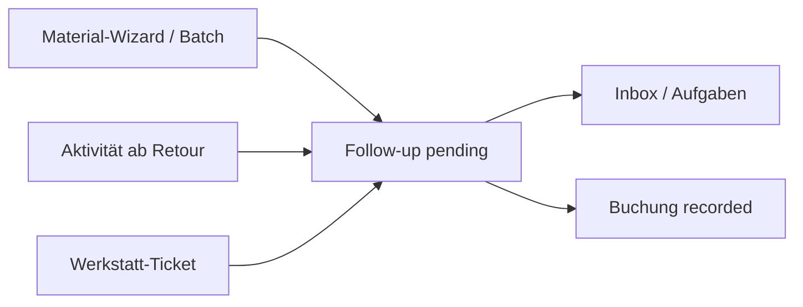

# Buchhaltung (eMatChef)

Unterstützende Kostenverwaltung für Material-Departments — **kein Ersatz** für das Vereins-Finanztool (Abacus, Bexio, Excel beim Kassier).

## Positionierung

| eMatChef Buchhaltung | Vereins-Finanztool |
| --- | --- |
| Materialbezogene Ausgaben erfassen & strukturieren | Vollständige Buchhaltung |
| Kostenstellen, Budget-Soll, Ist-Auswertungen | Kontenplan, Soll/Haben |
| CHF, keine MwSt. | MwSt., QR-Rechnung, OP-Liste |
| Export CSV für Abgleich | Revision, Bankabgleich |

## Zugriff

| Rolle | Zugriff |
| --- | --- |
| Materialwart (MW), Depchef (DC) | Vollzugriff: alle Tabs |
| Leiter 1–3 (L1–L3) | Lesesicht **Gruppenkosten** |
| Gruppenchef (Rolle `user` + Gruppenleitung) | Lesesicht **Gruppenkosten**, nur eigene Gruppen |

API-Schutz: `AccountingMwOrDcTrait` (Schreiben) bzw. `assertAccountingGroupReportAccess` (Gruppen-Report).

## Datenmodell

```
AccountingCostCenter          Kostenstellen (+ optional account_code)
AccountingCostCenterRule      source_kind → Kostenstelle (+ Default-Typ/Zahlungsart)
AccountingBooking             Ist-Buchung (CHF)
AccountingBudgetLine          Soll pro Kostenstelle/Jahr
AccountingAcquisitionFollowUp Warteschlange pending → recorded
```

### Buchung (`AccountingBooking`)

- **Typen:** `purchase`, `repair_external`, `repair_internal`, `amortization`, `other`
- **Zahlungsarten:** `advance_mw`, `cash_group`, `supplier_invoice`, `association`, `other`
- **Zahlungsstatus:** `open` (Forderung/offen), `paid`, `cancelled`
- Buchungsdatum ist nach dem Erfassen **nicht änderbar** (Jahr steckt in der ID `kb…`)

## UI-Tabs

| Tab | Route | Beschreibung |
| --- | --- | --- |
| Übersicht | `/accounting` | KPIs, Summen nach Jahr/Kostenstelle/Typ |
| Kostenstellen | `/accounting/kostenstellen` | CRUD + **Zuordnungsregeln** |
| Buchungen | `/accounting/buchungen` | Liste, CSV-Export, Tab «Neue Buchung zuordnen» |
| Gruppenkosten | `/accounting/gruppen` | Ist-Summen pro Gruppe, offene Posten |
| Materialkosten | `/accounting/materialkosten` | Ist pro Material |
| Abschreibung | `/accounting/abschreibung` | Vorschläge aus Anschaffungswerten |
| Budget | `/accounting/budget` | Soll/Ist + CSV |

## Workflow: Follow-ups

Material und Aktivitäten erzeugen **pending**-Aufträge; MW/DC ordnet in der Buchhaltung zu:



| source_kind | Auslöser | Verrechnungsziel |
| --- | --- | --- |
| `batch` | Anschaffung mit Preis | Department |
| `activity_consumption` | Verbrauch ab Retour | Gruppe |
| `activity_replenishment` | Nachkäufe bei `completed` | einreichendes Department |
| `activity_rental` | Externe Ausleihe | externer Kunde |
| `activity_workshop` | Werkstatt-Ticket | Material-Owner-Dep. / extern |

Details: [activities/status.md](./activities/status.md), [activities/material-pipeline.md](./activities/material-pipeline.md).

### Batch-Zuordnung

Mehrere Follow-ups **derselben Aktivität** können mit einer Kostenstelle gesammelt erfasst werden (`POST …/acquisition-followups/batch-record`).

### Zuordnungsregeln

Unter **Kostenstellen → Zuordnungsregeln** pro Department konfigurierbar. Überschreibt Keyword-Heuristik beim Tab «Neue Buchung zuordnen».

## Exporte

| Export | Endpoint | Format |
| --- | --- | --- |
| Budget Soll/Ist | `GET …/accounting/budget/comparison/{year}?format=csv` | CSV `;` |
| Buchungen | `GET …/accounting/bookings/export?year=YYYY` | CSV `;` mit Kontocode, Quelle, Status |

## API-Übersicht

| Bereich | Prefix |
| --- | --- |
| Kostenstellen | `/api/departments/{id}/accounting/cost-centers` |
| Regeln | `/api/departments/{id}/accounting/cost-center-rules` |
| Buchungen | `/api/departments/{id}/accounting/bookings` |
| Follow-ups | `/api/departments/{id}/accounting/acquisition-followups` |
| Gruppenkosten | `/api/departments/{id}/accounting/group-costs?year=` |
| Abschreibung | `/api/departments/{id}/accounting/amortization/suggestions` |
| Budget | `/api/departments/{id}/accounting/budget` |
| Übersicht | `/api/departments/{id}/accounting/overview` |

## Beleg-Uploads

Buchungen können **Beleg-Dateien** (Bild oder PDF) haben — gleiches Medien-Modell wie Material-Fotos:

- Speicher: `var/uploads/accounting/{departmentId}/{bookingId}/`
- Metadaten: JSON-Array `receipts` auf `accounting_booking` (Media-JSON)
- Max. **5 Belege** pro Buchung, max. **10 MB** je Datei
- Bilder werden komprimiert (wie andere Uploads), PDF unverändert

| Aktion | Endpoint |
| --- | --- |
| Upload | `POST …/accounting/bookings/{id}/receipts` (multipart `receipt`) |
| Download | `GET …/accounting/bookings/{id}/receipts/{filename}` |
| Löschen | `DELETE …/accounting/bookings/{id}/receipts/{filename}` |

Migration: `Version20260603160000` (`receipts` JSON-Spalte).

## Bewusst nicht im Scope

- Doppelbuch / Kontenplan
- MwSt.-Ausweisung
- Bankabgleich / Kassenbuch

## Migration

`Version20260603140000`: `payment_status` auf `accounting_booking`, Tabelle `accounting_cost_center_rule`.
