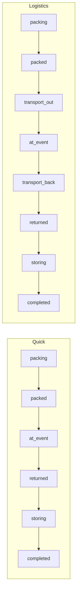

# Pack-/Bestell-Steps — Spezifikation (Top-10 #1)

**Status:** **Kern + 1d + 1c (Phase 1) erledigt** (Aug 2026) · Top-10 **#7 Phasen 1–6 erledigt** (Vermerk, Kosten folgen, Aufräumen)  
**Stand:** August 2026  
**Backlog:** [ideen-backlog.md](../future/ideen-backlog.md) · Sheet-Idee: *«steps bestellung gepackt mitgenommen am event zurückgebracht retour im materiallager»*

Ziel dieses Dokuments: **klar kommen**, ohne die Detail-Specs zu ersetzen. Detailregeln bleiben in den verlinkten Docs.

---

## 1. Was meint Punkt 1?

Material soll von der **Bestellung bis zurück ins Regal** in nachvollziehbaren Schritten laufen — für MW und Gruppe sichtbar, mit korrekten Mengen (auch Teilmengen).

| Alltags-Sprache (Sheet) | Bedeutung | System |
|-------------------------|-----------|--------|
| **bestellt** | Gewünschte Menge freigegeben | `activity_item` / `quantity_ordered` · Status bis `approved` |
| **gepackt** | MW hat Material im Lager bereit | Status `packing`→`packed` · `quantity_packed` |
| **mitgenommen** | Gruppe hat es mit / unterwegs | Quick: Ausgabe → `quantity_issued` · oft «Habe nur das mitgenommen» |
| **am Event** | Material ist am Anlass | Status `at_event` |
| **zurückgebracht** | Auf dem Rückweg (nur Lager-Events) | Status `transport_back` · `quantity_transport_back` |
| **retour** | Abgegeben, noch nicht eingelagert | Status `returned` · `quantity_returned` |
| **im Materiallager** | MW hat eingelagert | Status `storing`→`completed` · `quantity_stored` |

---

## 2. Zwei Ebenen (wichtigste Regel)

```
Aktivität (Stepper)     = «In welcher Phase ist der Anlass?»
Material (quantity_*)   = «Wo ist Stück X?»  — Teilmengen möglich
```

Beispiel: Status schon `at_event`, aber 2 Stück noch `packed` (nicht mitgenommen).

| Ebene | Speichert | Doc |
|-------|-----------|-----|
| Aktivität | `activity.status` | [status.md](./status.md) |
| Material | `quantity_packed`, `quantity_issued`, … `quantity_stored` | [material-pipeline.md](./material-pipeline.md) |
| Architektur | Stepper ≠ Pack-Buckets | [ADR](./newUI/ADR-workflow-layers.md) |

**Nicht vermischen:** Activity-Status und `quantity_*` sind unabhängig. Abschluss `completed` ≠ «alles stored» eins zu eins — Material kann geklärt sein (eingelagert **oder** Verlust/Reparatur gemeldet); Buchhaltung ist Top-10 #7.

---

## 3. Zwei Profile (Happy Path)

### Quick — Typ `activity` / `external`

```
bestellt → gepackt → mitgenommen/am Event → retour → einlagern → fertig
```

Technisch:

```
approved → packing → packed → at_event → returned → storing → completed
         quantity: ordered → packed → issued → returned → stored
```

- **Kein** Transport hin/zurück in UI und Backend (`transport_*` bleiben 0).
- **«Habe nur das mitgenommen»:** Status → `at_event`, Rest bleibt gepackt; nächster Fokus = Retour.
- **external:** nur MW bearbeitet Packliste; Mieter hat keinen Pack-Zugang.

### Logistics — Typ `camp` / `event`

```
bestellt → gepackt → Transport hin → am Event → Transport zurück → retour → einlagern → fertig
```

Technisch:

```
… → packed → transport_out → at_event → transport_back → returned → storing → completed
```

- Volle Pipeline inkl. `quantity_transport_to` / `quantity_transport_back`.
- Bei `at_event`: aktiver Step = Ausgabe (`issue`), **kein** Quick-Sprung auf Retour.

Rollen-Matrix (wer packt / wer ausgibt / wer einlagert): [material-pipeline.md](./material-pipeline.md) · [pack-workflow-rules.md](./pack-workflow-rules.md).



---

## 4. UI: Journey ist der Weg

| | |
|--|--|
| **Standard** | Material-Journey (`pack-journey`) |
| **Fallback** | Legacy Packliste `?packUi=legacy` |
| **Handheld** | [devices/](../devices/) — parallel, gleiche Pipeline-Idee |

Jeder Step = Übergang **links (noch nicht) → rechts (schon)**. Kisten, Verbrauch, lose Mengen: [pack-workflow-rules.md](./pack-workflow-rules.md).

---

## 5. Ist-Stand vs. Restarbeit

### Erledigt (Kern von #1)

- [x] Activity-Status inkl. `transport_out`, `transport_back`, `storing`
- [x] Material-Pipeline bis `quantity_stored`
- [x] Quick- und Logistics-Ketten im Backend + Journey
- [x] Journey an zentrale Regeln (Phasen A–D Todo) — [journey-pack-workflow-todo.md](./journey-pack-workflow-todo.md)
- [x] «Habe nur das mitgenommen», Retour-Handoff, Einlagern-UI
- [x] Automatisierte Abnahme D1–D3, D5
- [x] **1a** Manuelle Logistics-Abnahme D4 (Pfila 2026)
- [x] **1b** Step-Fluss-DoD (Handoff-Banner, 375px-Smoke, `not_taken`, Logistics «Einlagern starten»)
- [x] Step-Flow-Bugs P0/P1 (Retour-Bulk, packed→`transport_out`, Tour-Sync)

### Rest von #1 — bewusst ausgelagert

| ID | Was | Wohin |
|----|-----|-------|
| **1c** | Abschluss-Blocker / Buchhaltung entkoppeln | ✅ Phase 1 (#7) — [accounting.md](../accounting.md#zwei-abschlüsse-kernmodell) |
| **1d** | Kombos in Journey (`together` Sheet+Scan, `self_provided`) + Nachbearbeitung | **C1–C12 erledigt** — [combos/verbesserungen.md](../material/combos/verbesserungen.md) |

### Nicht Teil von #1 (eigene Backlog-Punkte)

| Idee | Wohin |
|------|--------|
| Material nachbuchen Modal (inkl. Pipeline-Ziel) | Nice-to-have / eigener Chat — nicht Step-Fluss-Blocker |
| Parität Legacy §22 gesamt | auslagern — Journey ist Primär-UI |
| Completion-Blocker / Buchhaltung | Top-10 **#7** |
| Packen nach Gestell-Kategorien | Eigene Idee — heute nur Regal-Filter/Gruppierung, kein Gestell-Walkthrough |
| Scanseite / Offline / Handheld-PIN | Top-10 #2 / #3 |
| Verbrauchsmat vereinfachen | Top-10 #5 |
| Abrechnung Bar/Rechnung | Top-10 #7 |
| Kombo-Stammdaten (BOM-Warnung, Unfinalize, Vorlagen) | ✅ C8–C12 — [combos/verbesserungen.md](../material/combos/verbesserungen.md) |

---

## 6. Definition of Done für #1

**Kern-DoD (Aug 2026 — erfüllt):**

1. ✅ Quick Happy Path (inkl. Teilausgabe / «nur mitgenommen») Specs + manuell.
2. ✅ Logistics Happy Path manuell (**1a** D4).
3. ✅ Keine bekannten Blocker, die Steps überspringen oder Mengen falsch buchen (P0/P1 gefixt).
4. ✅ Step-Fluss-DoD erledigt bzw. Nicht-Step-Punkte ausgelagert (**1b**).
5. ➡️ **1c** an **#7** übergeben.
6. ✅ **1d** A+B (C1–C7) + Stammdaten C8–C12 erledigt.

**Vollständig «Backlog #1 zu»** erst wenn zusätzlich 1d (+ optional 1c/#7) erledigt — bis dahin: *Kern erledigt / Rest → 1d + #7*.

---

## 7. Empfohlene Reihenfolge (Stand nach Kern)

```
✅ 1a  Logistics D4 + Step-Flow-Bugs
✅ 1b  SPEC-DoD Step-Fluss
➡️ 1d  Kombos Journey — neuer Chat
➡️ 1c / #7  Abschluss-Blocker + Abrechnung
```

**Nächster Chat — 1d Kombos:**

```
Thema: Top-10 #1d — Kombos in Journey / Aktivität

Kontext:
- docs/activities/pack-steps-spezifikation.md  (Slice 1d)
- docs/material/combos/verbesserungen.md
- docs/material/combos/virtual-combo-activities.md
- docs/activities/newUI/SPEC.md  (§5.3 virtual_crate / self_provided)

Fokus zuerst: C1 + C2 (together Sheet + Scan), dann C3 + C4.
Optional danach C5–C7 (Nachbearbeitung) nur wenn C1–C3 grün.
Nicht anfassen ohne Rückfrage: Stammdaten C8–C12, Offline/Scan-Geräte (#2/#3), Abrechnung (#7).
```

---

## 8. Schnell-Referenz Code

| Thema | Ort |
|-------|-----|
| Status / Übergänge | `backend/src/Entity/Activity.php` |
| Mengen verschieben | `backend/src/Service/PackPipelineService.php` |
| Regeln UI | `frontend/src/utils/packWorkflowRules.ts` |
| Journey Steps | `frontend/src/…/materialJourneySteps.ts`, `materialJourneyNavigation.ts` |
| Journey View | `ActivityMaterialJourneyView.vue` / `ActivityPackJourneyView.vue` |

---

## Siehe auch

| Doc | Wann lesen |
|-----|------------|
| [material-pipeline.md](./material-pipeline.md) | Mengen, Quick vs Logistics, Sperren |
| [status.md](./status.md) | Activity-Status-Liste |
| [pack-workflow-rules.md](./pack-workflow-rules.md) | Tabs, Rollen, Kistencheck |
| [journey-pack-workflow-todo.md](./journey-pack-workflow-todo.md) | Was A–D schon gelöst hat |
| [journey-pack-workflow-abnahme.md](./journey-pack-workflow-abnahme.md) | Checkliste D1–D5 |
| [combos/verbesserungen.md](../material/combos/verbesserungen.md) | Slice **1d**: Journey together / Scan / self_provided |
| [devices/pack-workflow.md](../devices/pack-workflow.md) | Scan am Handheld |
