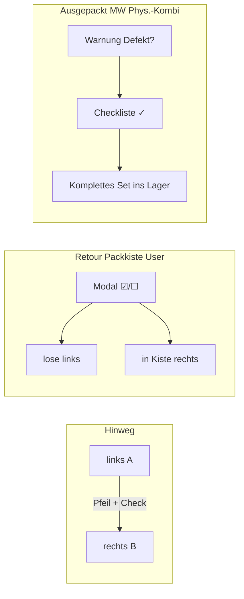

# Pack-Workflow — einheitliche Regeln

Ziel-Spezifikation für die **Packliste** (`ActivityPackListTab`): ein Kernmodell (links/rechts), vier Materialarten, wenige Sonderregeln. Verstreute `if (stage)`-Filter sind in die zentrale Regel-Matrix `packWorkflowRules.ts` migriert; `ActivityPackListTab` bindet sie über `packListCtx` / `packContainerCtx` an.

**Stand:** Juni 2026 · **Status:** Regel-Matrix und Kern-Flows umgesetzt; weitere Migration aus `ActivityPackListTab` läuft

**Verwandt:** [material-pipeline.md](./material-pipeline.md) · [pack-step-ui.md](./pack-step-ui.md) · [status.md](./status.md) · [Virtuelle Kombo (Pack-Flow)](../material/combos/virtual-combo-activities.md)

---

## 1. Kern (gilt für jede Etappe)

Jeder Tab ist ein **Übergang A → B**:

| Seite | Bedeutung | Aktion |
|-------|-----------|--------|
| **Links** | Noch nicht in B | Pfeil: qty **A → B** |
| **Rechts** | Bereits in B | Pfeil: qty **B → A** (Retour / Zurück) |

Mengenlogik zentral in `packStageQuantities.ts`:
- **Buckets:** `getStageLeftQty` / `getStageRightQty` (Pipeline-Felder pro Tab)
- **Schicht lose/Kiste/Spiegel:** `packStageQuantityLayer.ts` (`computeLooseQtyForPackItem`, `computePackIssueForwardMax`, …) — `ActivityPackListTab` liefert nur `PackQuantityContext`

Die UI-Regeln in `packWorkflowRules.ts` steuern **Anzeige**, **Kistencheck** und **Sonderfälle**.

---

## 2. Vier Materialarten

| Art | Packliste | Rubrik «Packkisten» | Anmerkung |
|-----|-----------|---------------------|-----------|
| **Loses Material** | Kategorie-Zeile | — | Einzelstück ohne Behälter |
| **Packkiste** | Rubrik Packkisten | ✓ | MW legt bei **Bestätigt → Gepackt** an (Rakokiste, Kochkiste, …) |
| **Phys. Kombi** | Kategorie-Zeile + Badge | **nie** | Zelt/Set; Hülle (Kiste/Sack) gehört zum Set, nicht zur Packkisten-Rubrik |
| **Virt. Kombi** | siehe unten | **`together`:** logische Packkiste ✓ · **`loose`:** Kategorie (Einzelteile) | User wählt `pack_mode` beim Buchen — [virtual-combo-activities.md](../material/combos/virtual-combo-activities.md) |

> **Virt. Kombi — Placement nach `pack_mode`:**
> - **`together`:** Backend erzeugt logischen `activity_pack_container` (ohne Lager-Batch) → Anzeige **nur** unter Packkisten; stock-Komponenten nicht doppelt in der Kategorie.
> - **`loose`:** Flache Pack-Zeilen wie loses Material → MW entscheidet ab Bestätigt→Gepackt selbst (Kiste ja/nein, eine oder mehrere Kisten).
> - **`self_provided`:** nie in Container — Hinweis/Checkliste für Ersteller und MW.

### Einbuchen

| Zeitpunkt | Verhalten |
|-----------|-----------|
| **Bestätigt → Gepackt** | MW kann Material optional in Packkiste oder in die Hülle einer Phys.-Kombi einbuchen |
| **Später hinzugefügt** | Material bleibt **lose** in der Kategorie |

### Platzierung (keine Doppelanzeige)

```
Packkiste                    → nur Rubrik «Packkisten»
Phys. Kombi                  → nur Kategorie-Zeile (+ Badge)
Virt. Kombi (pack_mode together) → logische Packkiste → nur Rubrik «Packkisten»
Virt. Kombi (pack_mode loose)    → stock-Teile wie loses Material → Kategorie-Zeile
Loses Material               → nur Kategorie-Zeile
Shell in Kategorie           → dieselbe Einheit nicht nochmals unter Packkisten
```

---

## 3. Tabs: Profil × Rolle

| Profil | Aktivitätstyp | MW / DC | User / L1 / L2 / L3 |
|--------|---------------|---------|---------------------|
| **quick** | `activity` | Bestätigt→Gepackt, Gepackt→Event, Event→Retour, Retour→Ausgepackt | Gepackt→Event, Event→Retour |

Quick/External: Tab «Gepackt→Am Event» (`packed_at_event`) — Pipeline `quantity_packed → quantity_issued` (ohne Transport-Felder).
| **logistics** | Camp / Event | wie quick + Transport (hin), Transport→Event, Event→Transport zurück | Transport hin … Retour (ohne Packen & Einlagern) |
| **external** | Extern | wie quick (MW) | nur **lesen** — MW bearbeitet durchgehend |

**MW/DC = Ersteller:** kein Gruppen-Notfallmodus — Material normal auf dem aktiven Tab verschieben (`packMwIsActivityCreator`).

Rollen im Code: `canManageMaterials` (MW/DC vs. Rest). L1–L3 verhalten sich wie User.

---

## 4. Kistencheck — drei Beine, zwei Modi

| Bein | Wann | MW / DC | User / L1–L3 |
|------|------|---------|--------------|
| **outbound** | Hinweg | bei **Bestätigt → Gepackt** (Packen) | beim **ersten** Hinweg-Verschieben |
| **return** | Retour | voll (s. Abschnitt 5) | **leicht** (s. Abschnitt 5) |
| **warehouse_store** | Retour → Ausgepackt | voll + Checkliste Phys.-Kombi (s. Abschnitt 6) | — |

**Modi:**

| Modus | Wer | Verhalten |
|-------|-----|-----------|
| **voll** | MW / DC | Zählen, Abweichungen, Auffüllen aus Lager, ggf. Werkstatt-Ticket |
| **leicht** | User / L1–L3 | Zählen + Aufteilen, **kein** Workshop-Ticket |

Pro Benutzer und Bein: Check **einmal** pro `(packItemId, leg, userId)` — erneut prüfen optional (Gruppe).

Leg-Zuordnung: `packCrateCheckLeg.ts` (`outbound` | `return` | `warehouse_store`).

---

## 5. Retour — ganze Packkiste (User / L1–L3)

Bei **Event → Retour** oder **Event → Transport zurück**: ein Modal, ein Klick.

```
☑ abgehakt     → bleibt in der Kiste  → rechts (retourniert in Kiste)
☐ nicht abgehakt → wird lose          → links (lose Retour-Liste)
```

- **Kein** Workshop-Ticket im leichten Modus
- MW behält vollen Kistencheck mit Meldungen und Nachlegen

---

## 6. Ausgepackt — Phys. Kombi (MW / DC)

Kein Zeile-für-Zeile-Pfeil für das Set, sondern **Checkliste + ein Button**:

```
┌─ Phys. Kombi «Spatz 8er Grün» ─────────────────────┐
│  ⚠ Defekt gemeldet: … (falls offene Meldung)       │
│                                                    │
│  ☐ Aussenzelt Spatz          Soll: 1              │
│  ☐ Innenzelt Spatz           Soll: 1              │
│  ☐ Stangen 2m                Soll: 4              │
│  …                                                 │
│                                                    │
│  [ Komplettes Set ins Lager ]  (disabled)         │
└────────────────────────────────────────────────────┘
```

| Schritt | Regel |
|---------|--------|
| 1 | MW hakt jede Komponente ab (✓ = da / i.O.) |
| 2 | Button **«Komplettes Set ins Lager»** erst aktiv, wenn **alle** Zeilen ✓ |
| 3 | Klick speichert `warehouse_store`-Check und bucht **ganzes Set** ein (Inhalt + Hülle) |

### Ausgepackt — Packkiste (MW / DC)

| Zustand | Reihenfolge |
|---------|-------------|
| Mit transportiertem Inhalt | **Inhalt zuerst**, Packkiste (Hülle) **zuletzt** |
| Leere Hülle zurück | Hülle **sofort** ins Inventar buchbar |

### Ausgepackt — loses Material

Wie bisher: Pfeil pro Zeile ins Lager.

---

## 7. Verlust / Reparatur

### Sichtbarkeit

Ab Tab **Transport → Event** bis **Transport zurück** (lose Zeilen und Kistenzeilen).

| Art | UI |
|-----|-----|
| **Loses Material** | Verlust- / Reparatur-Buttons an der Zeile |
| **Phys. Kombi** | Hinweis im **Header** (Verlust/Reparatur) → Modal: **welche Komponente?** → spezifisches Werkstatt-Ticket |

### MW bei Retour → Ausgepackt

1. **Warnung**, wenn Defekt/Reparatur gemeldet wurde
2. `warehouse_store`-Checkliste (Abschnitt 6)
3. Fehlende Teile **aus Lager auffüllen** (wenn vorhanden) → Combo wieder komplett
4. **Werkstatt-Ticket nach Reparatur:** Material zurück ins **Inventar**, **nicht** in die Combo

Virt. Kombi mit verschachtelter Phys.-Kombi: Meldung auf der **betroffenen Komponente** (nicht auf dem virtuellen Container).

---

## 8. Zentrale Regel-Matrix (Implementierung)

Alles in **einer** Lookup-Datei `packWorkflowRules.ts` — keine verstreuten Listen-Filter in der Vue-Datei.

```typescript
// Profil / Placement
tabs(profile, role)
canEdit(profile, role, status)
showContainersUi(profile, stage)
placement(kind)

// Listen-Filter (über PackWorkflowListContext / PackWorkflowContainerContext)
shouldIncludePackItemOnStageLeft(p, ctx)
shouldIncludePackItemOnRightLooseMirror(p, ctx)
shouldIncludePackItemOnReturnedLoose / OnStoredLoose / OnReturnNotTaken / …
shouldIncludePackItemInLooseOnlyGroup / InLoosePartialGroup(p, ctx)
shouldShowContainerOnStageLeft(containerId, ctx)      // Kiste noch links (A)
shouldShowContainerOnRightMirror(containerId, ctx)    // Kiste rechts im Spiegel (B)
shouldShowPackContainerInWarehouseVisibleList(c, ctx, stageLeftItems)
shouldShowPackContainerOnConfirmedPackedRight(c, ctx, stageLeftItems)
shouldShowPackItemAsCategoryShellRow(p, ctx)
packCrateTravelsWithShellAtForwardStage(containerId, ctx)
containerLineBackwardMax / containerBackwardUnits / containerLineBackwardPatch  // ← Pfeil rechts
packCrateTargetSelectable(stage)                    // Kiste wählbar (grüne Karte)
packCrateAssignSource(stage)                        // 'packed-left' | 'loose-at-event' | null
packShowCrateAssignUpControls(p, ctx, source)       // ↑-Pfeil + grün
packCrateAssignUpMax(p, ctx, source)
packCrateSectionShowsTargetSelect(stage, panel)     // grüner Kisten-Rahmen
packMoveControlDirectionForCrateAssign(show)        // 'assign-up' | 'forward'
packCrateContainerUseSubsections()                  // immer flach — kein Fix/Zusatz-Accordion
packCrateContainerContentUseSubsections()         // Sortierung Packliste→Fix→Zusatz bleibt
packCrateShowPullFromContainer(stage)               // ← aus Kiste (nur Bestätigt→Gepackt)
packMwIsActivityCreator / packMwGroupHandoffActive  // Notfall nur wenn MW ≠ Ersteller

// Sonderregeln
check(leg, role)             // null | 'lightweight' | 'full'
returnCrateMode(role)        // 'lightweight_modal' (☑/☐) | 'full'
issuesVisible(stage)         // transport_to_at_event … at_event_transport_back
issuesUi(kind)               // 'row_buttons' | 'combo_header_modal'
storePhysCombo(role)         // null | 'checklist'
```

---

## 9. Abläufe (Überblick)



---

## 10. Ist-Stand vs. Ziel (Kurz)

| Thema | Ziel | Code (Juni 2026) |
|-------|------|------------------|
| Links/rechts | einheitlich | ✓ `packStageQuantities.ts` |
| `packWorkflowRules.ts` | eine Matrix | ✓ Tabs, Placement, Listen-Filter, Check-Modi |
| Phys.-Kombi nicht unter Packkisten | ja | ✓ `packContainerHiddenInCratesSection` |
| Member Retour ohne Ticket | leichtes Modal ☑/☐ | ✓ `lightweight` API + kein Verlust/Reparatur im Return-Modal |
| Phys.-Kombi Ausgepackt | Checkliste → Set-Button | ✓ `PackPhysComboStoreChecklistModal` |
| Verlust/Reparatur Zeitraum | ab Transport→Event | ✓ `packIssuesVisibleForStage` |
| External User | read-only | ✓ `packWorkflowCanEdit` + Member-Tabs |
| Vollständige Migration UI-Filter | eine Matrix | ✓ Listen + Kisten + Zurück-Pfeil + Kistenziel/↑ in `packWorkflowRules.ts` |

---

## 11. Code-Referenzen

| Thema | Pfad |
|-------|------|
| Stufen & Mengen | `packStageQuantities.ts` · `packStageQuantityLayer.ts` |
| Profile & Tabs | `frontend/src/components/activities/packWorkflowProfile.ts` |
| Kistencheck-Legs | `frontend/src/components/activities/packCrateCheckLeg.ts` |
| Shell / Packkiste / Kombi | `frontend/src/components/activities/packShellCrateHelpers.ts` |
| Kistencheck-Modal | `frontend/src/components/activities/PackCrateShellForwardModal.vue` |
| Retour-Kisten-Modal | `ReturnCrateModal` in `ActivityPackListTab.vue` |
| Phys.-Kombi Verlust/Reparatur | `PhysicalComboIssueComponentModal.vue` |
| **Regel-Matrix** | `frontend/src/components/activities/packWorkflowRules.ts` |
| Phys.-Kombi Einlagern-Modal | `frontend/src/components/activities/PackPhysComboStoreChecklistModal.vue` |
| Pack-Haupt-UI | `frontend/src/components/activities/ActivityPackListTab.vue` |
| Kistencheck Backend | `backend/src/Service/ActivityPackCrateCheckService.php` |
