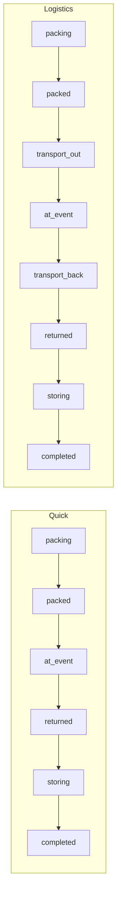

# Aktivitäts-Status

Übersicht aller Status einer **Aktivität** (Anlass / Event / Lager) in eMatChef.

**Quelle im Code (Ziel):** `backend/src/Entity/Activity.php` (`ALL_STATUSES`, `STATUS_TRANSITIONS`, `TRANSITION_PERMISSIONS`)  
**Anzeige (DE):** `frontend/src/locales/de.json` → `activities.status.*`  
**Architektur:** [newUI/ADR-workflow-layers.md](./newUI/ADR-workflow-layers.md) — Stepper = Activity-Status; Material unabhängig (`quantity_*`)

**Stand:** Juni 2026 · **Umgesetzt** (neue Status `transport_out`, `transport_back`, `storing`; `pack_journey_step` entfernt; Stepper leitet aus `activity.status` ab)

---

## Status-Liste

### Freigabe & Abschluss

| Technischer Key | Anzeige (DE) | Bedeutung |
|-----------------|--------------|-----------|
| `draft` | Entwurf | Aktivität angelegt, Material/Details noch bearbeitbar, nicht eingereicht |
| `submitted` | Eingereicht | Gruppe/Ersteller hat eingereicht; wartet auf Freigabe durch MW/DC |
| `approved` | Bestätigt | Material freigegeben; Packen kann starten |
| `completed` | Abgeschlossen | Material physisch geklärt (Vorgangsabschluss); Buchhaltung separat |
| `cancelled` | Storniert | Aktivität abgebrochen |

### Pack & Event

| Technischer Key | Anzeige (DE) | Stepper (Journey-UI) | Bedeutung |
|-----------------|--------------|----------------------|-----------|
| `packing` | Wird gepackt | `pack` | Packliste wird bearbeitet |
| `packed` | Gepackt | — | Packen abgeschlossen; bereit für Transport/Ausgabe |
| `transport_out` | Transport hin | `transport_out` | Logistics: Material unterwegs zum Anlass |
| `at_event` | Am Anlass | `issue` *(UI-Label)* | Material am Event / Ausgabe-Phase |
| `transport_back` | Transport zurück | `transport_back` | Logistics: Rücktransport ins Lager |
| `returned` | Retour | `return` | Gruppe hat abgegeben |
| `storing` | Einlagern | `store` | MW lagert Material ins Regal |

**Quick** (`activity`, `external`): `transport_out` und `transport_back` entfallen im Workflow — siehe [Übergänge](#pack-event-logistics-vs-quick).

---

## Status-Farben (UI)

Einheitlich in `frontend/src/styles/activity-status.css` (Dashboard, Aktivitäten-Liste, Detail, Infoscreen):

| Key | Punkt-Farbe | Bedeutung |
|-----|-------------|-----------|
| `draft` | Grau | Entwurf |
| `submitted` | Blau | Eingereicht |
| `approved` | Grün | Bestätigt |
| `packing` | Orange | Wird gepackt |
| `packed` | Primary (Grün) | Gepackt |
| `transport_out` | *(noch zu definieren)* | Transport hin |
| `at_event` | Dunkelgrün | Am Anlass |
| `transport_back` | *(noch zu definieren)* | Transport zurück |
| `returned` | Türkis | Retour |
| `storing` | *(noch zu definieren)* | Einlagern |
| `completed` | Grau | Abgeschlossen |
| `cancelled` | Rot | Storniert |

---

## Typischer Happy Path

### Quick (`activity` / `external`)

```
… → Wird gepackt → Gepackt → Am Anlass → Retour → Einlagern → Abgeschlossen
     packing      packed    at_event    returned  storing    completed
```

### Logistics (`camp` / `event`)

```
… → Gepackt → Transport hin → Am Anlass → Transport zurück → Retour → Einlagern → Abgeschlossen
     packed   transport_out  at_event   transport_back      returned storing    completed
```



---

## Erlaubte Übergänge

### Freigabe (unverändert)

| Von | Nach (erlaubt) |
|-----|----------------|
| `draft` | `submitted`, `cancelled` |
| `submitted` | `approved`, `packing`, `cancelled` |
| `approved` | `packing`, `submitted` (Zurückweisung), `cancelled` |
| `packing` | `packed`, `cancelled` |

### Pack & Event — Logistics

| Von | Nach (erlaubt) |
|-----|----------------|
| `packed` | `transport_out`, `packing` (zurück), `cancelled` |
| `transport_out` | `at_event`, `packed` (Korrektur) |
| `at_event` | `transport_back`, `packed` (Korrektur, MW) |
| `transport_back` | `returned`, `at_event` (Korrektur, MW) |
| `returned` | `storing`, `at_event` (Korrektur, MW) |
| `storing` | `completed`, `returned` (Korrektur, MW) |
| `completed` | — (Endstatus) |

### Pack & Event — Quick

| Von | Nach (erlaubt) |
|-----|----------------|
| `packed` | `at_event`, `packing` (zurück), `cancelled` |
| `at_event` | `returned`, `packed` (Korrektur, MW) |
| `returned` | `storing`, `at_event` (Korrektur, MW) |
| `storing` | `completed`, `returned` (Korrektur, MW) |

**Hinweis:** Die exakte Matrix in `Activity::STATUS_TRANSITIONS` wird bei der Code-Migration angepasst. Bis dahin gilt der **bestehende** Code (ohne `transport_out`, `transport_back`, `storing`).

### Transport-Touren & Ankunft (Logistics)

| Journey-Schritt | Touren-Aktion | Pipeline |
|-----------------|---------------|----------|
| `transport_out` | Planen, zuordnen, **Abfahren** (`in_transit`) | Checkliste: `packed` → `transport_to` |
| `issue` (Am Anlass) | **Angekommen** pro Tour oder Bulk | `transport_to` → `issued` |
| `transport_back` | Rückfahrt planen/laden (Pfeile → `transport_back`); Bulk **«Alles zurück… ist da»** | Laden: `issued` → `transport_back`; Ankunft: `transport_back` → `returned` |

Tour-Status: `planned` → `in_transit` → `arrived`. Outbound-Ankunft auf `issue`; Inbound-Ankunft (Bulk) auf `transport_back` bucht `quantity_returned`.

### Besondere Wege

- **`submitted` → `packing`:** Annehmen und direkt mit Packen beginnen.
- **`approved` → `submitted`:** Zurückweisung durch Materialwart/DC.
- **`packed` → `packing`:** Zurück zum Packen (Korrektur).
- **Teilausgabe:** Status `at_event` auch wenn Rest noch `quantity_packed` hat — Material unabhängig, siehe [material-pipeline.md](./material-pipeline.md).

### Quick-Modus (Typ «activity») vs. Lager/Event vs. Extern

| Aspekt | Typ `activity` | Typ `camp` / `event` | Typ `external` |
|--------|------------------|----------------------|----------------|
| **Transport-Status** | entfällt | `transport_out`, `transport_back` | entfällt |
| **Anlegen** | alle Department-Mitglieder | User, Gruppenchef, Leiter | nur MW |
| **Einreichen** | Ersteller, Gruppenchef, DC, MW | Ersteller oder Gruppenchef | nur MW |
| **Packen** | MW + Gruppe ab «gepackt» | MW packt; Gruppe ab «gepackt» | nur MW |

Technisch Quick: Frontend sendet `submitted`; Backend setzt bei Typ `activity` oft direkt `approved`.

---

## Wer darf welchen Übergang?

Rollen-Kontext (Ziel — Auszug; Details bei Migration in `TRANSITION_PERMISSIONS`):

| Übergang | Typische Berechtigte |
|----------|----------------------|
| `packing` → `packed` | MW, Org-Admin, Super-Admin |
| `packed` → `at_event` / `transport_out` | MW, Gruppe/Ersteller (Profil) |
| `transport_out` → `at_event` | MW, Gruppe/Ersteller |
| `at_event` → `transport_back` | MW, Gruppe/Ersteller |
| `transport_back` → `returned` | MW, Gruppe/Ersteller |
| `returned` → `storing` | MW, DC |
| `storing` → `completed` | MW, Org-Admin, Super-Admin |

**Gruppe** ist bei Ausgabe, Transport und Retour aktiv. **Abschliessen** obliegt dem Materialwart/DC.

---

## Journey-Stepper = Activity-Status

Der Material-Journey-Stepper ([newUI/](./newUI/)) zeigt **dieselbe** Workflow-Achse wie `activity.status`:

- **Kein** separates Feld `pack_journey_step` (entfernt).
- Stepper-Klick = nur Navigation (URL), kein Status-Schreiben.
- Primary-Button unten = derselbe Übergang wie Header-Button (`PATCH /status`).

Details: [ADR-workflow-layers.md](./newUI/ADR-workflow-layers.md)

---

## Abgrenzung: Aktivitäts-Status vs. Material-Pipeline

Zwei **getrennte** Ebenen:

| Ebene | Frage | Beispiel |
|-------|--------|----------|
| **Aktivität** | Workflow-Phase, Rollen, Inbox | `at_event` |
| **Material** | Wo liegen wie viele Stück? | 4× `quantity_issued`, 2× `quantity_packed` |

Vollständige Beschreibung: **[material-pipeline.md](./material-pipeline.md)**

### Aktivitäts-Abschluss (`storing` → `completed`)

**Zielmodell** (siehe [accounting.md — Zwei Abschlüsse](../accounting.md#zwei-abschlüsse-kernmodell)):

Jedes Material ist geklärt, wenn es **eingelagert** ist **oder** Verlust/Reparatur **gemeldet** ist (Werkstatt-Pfad) **oder** Verlust gemeldet ist. **Buchhaltung blockiert den Aktivitäts-Abschluss nicht.** Offene Werkstatt-*Bearbeitung* (Ticket noch nicht erledigt, keine `actual_cost`) blockiert `completed` ebenfalls **nicht** — nur fehlende Disposition (weder eingelagert noch gemeldet).

Direkt `returned` → `completed` ist nicht vorgesehen — zuerst `storing`.

**Ist-Code (Phase 1):** Harter Blocker nur `unstored_pack_items`. Offene Werkstatt-Tickets, Issue-Reports und `pending_accounting_followups` erscheinen in der Checkliste als Hinweise.

**UI bei `returned` / `storing`:** Abschluss-Checkliste für MW/DC (`completion_blockers` aus `GET /api/activities/{id}/transitions`). Optional: Kosten freigeben / später Einnahme-Vermerk (Bar/Rechnung) — keine fertige Buchung; effektive Abrechnung in `/accounting`.

---

## API

Status setzen: `PATCH /api/activities/{id}/status`  
Verlauf: `GET /api/activities/{id}/history` (Einträge z. B. `status_changed`)

**Deprecated (Ziel):** `PATCH /api/activities/{id}/pack-journey-step`

---

## Siehe auch

- [Buchhaltung — Zwei Abschlüsse](../accounting.md#zwei-abschlüsse-kernmodell)
- [ADR Workflow-Layers](./newUI/ADR-workflow-layers.md)
- [Material-Pipeline](./material-pipeline.md)
- [Pack-Workflow — einheitliche Regeln](./pack-workflow-rules.md)
- [Material-Journey UI](./newUI/README.md)
- [Nachrichtenzentrale](../nachrichtenzentrale.md)
