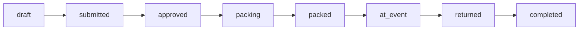

# Aktivitäts-Status

Übersicht aller Status einer **Aktivität** (Anlass / Event / Lager) in eMatChef.

**Quelle im Code:** `backend/src/Entity/Activity.php` (`ALL_STATUSES`, `STATUS_TRANSITIONS`, `TRANSITION_PERMISSIONS`)  
**Anzeige (DE):** `frontend/src/locales/de.json` → `activities.status.*`

**Stand:** Mai 2026

---

## Status-Liste

| Technischer Key | Anzeige (DE) | Bedeutung |
|-----------------|--------------|-----------|
| `draft` | Entwurf | Aktivität angelegt, Material/Details noch bearbeitbar, nicht eingereicht |
| `submitted` | Eingereicht | Gruppe/Ersteller hat eingereicht; wartet auf Freigabe durch MW/DC |
| `approved` | Bestätigt | Material freigegeben; Packen kann starten |
| `packing` | Wird gepackt | Packliste wird bearbeitet (Material wird gepackt / in Kisten gelegt) |
| `packed` | Gepackt | Packen abgeschlossen; Material bereit für Ausgabe ans Event |
| `at_event` | Am Event | Material ist bei der Gruppe / am Anlass |
| `returned` | Retour | Gruppe hat retourniert; MW/DC prüft und räumt ins Lager ein |
| `completed` | Abgeschlossen | Alles erledigt (Retour verarbeitet, Abrechnung finalisiert) |
| `cancelled` | Storniert | Aktivität abgebrochen |

---

## Status-Farben (UI)

Einheitlich in `frontend/src/styles/activity-status.css` (Dashboard, Aktivitäten-Liste, Detail, Infoscreen):

| Key | Punkt-Farbe | Bedeutung |
|-----|-------------|-----------|
| `draft` | Grau | Entwurf |
| `submitted` | Blau | Eingereicht |
| `approved` | Grün | Bestätigt |
| `packing` | Orange | Wird gepackt |
| `packed` | Primary (Grün) | Gepackt |
| `at_event` | Dunkelgrün | Am Event |
| `returned` | Türkis | Retour |
| `completed` | Grau | Abgeschlossen |
| `cancelled` | Rot | Storniert |

Transport-Stufen (`transport_to`, `transport_back`) sind **Pack-Pipeline**, keine Aktivitäts-Status — siehe [material-pipeline.md](./material-pipeline.md).

---

## Typischer Happy Path

```
Entwurf → Eingereicht → Bestätigt → Wird gepackt → Gepackt → Am Event → Retour → Abgeschlossen
 draft  →  submitted  →  approved  →   packing   →  packed  → at_event → returned → completed
```



---

## Erlaubte Übergänge

Aus `Activity::STATUS_TRANSITIONS`:

| Von | Nach (erlaubt) |
|-----|----------------|
| `draft` | `submitted`, `cancelled` |
| `submitted` | `approved`, `packing`, `cancelled` |
| `approved` | `packing`, `submitted` (Zurückweisung), `cancelled` |
| `packing` | `packed`, `cancelled` |
| `packed` | `at_event`, `packing` (zurück), `cancelled` |
| `at_event` | `returned` |
| `returned` | `completed` |
| `completed` | — (Endstatus) |
| `cancelled` | — (Endstatus) |

### Besondere Wege

- **`submitted` → `packing`:** Annehmen und direkt mit Packen beginnen (ohne Zwischenstatus «Bestätigt»).
- **`approved` → `submitted`:** Zurückweisung durch Materialwart/DC (mit Kommentar möglich).
- **`packed` → `packing`:** Zurück zum Packen (Korrektur).
- **`draft` / mehrere Stufen → `cancelled`:** Storno.

### Quick-Modus (Typ «activity») vs. Lager/Event vs. Extern

| Aspekt | Typ `activity` | Typ `camp` / `event` | Typ `external` |
|--------|------------------|----------------------|----------------|
| **Anlegen** | alle Department-Mitglieder (Gruppenmitglied `u` nur «Aktivität») | User (`u`), Gruppenchef, Leiter 1–3 | **nur Materialwart** |
| **Start-Status** | Entwurf (Quick: Auto-Einreichung möglich) | **immer Entwurf** | Entwurf |
| **Material im Entwurf** | Gruppe + Untergruppen | Gruppe + Untergruppen | MW |
| **Einreichen** | Ersteller, Gruppenchef, DC, MW | **nur Ersteller oder Gruppenchef** | **nur MW** |
| **Nach Einreichung Material** | nur MW/DC (bis «Am Event») | nur MW/DC (bis «Am Event») | nur MW/DC |
| Gruppenchef «Bestätigen» | entfällt — Material bei Einreichung final | `submitted` → `approved` (Leader/MW) | — |
| MW-Aktion danach | «Packen starten» | «Bestätigen» / «Annehmen & Packen» | Packen / Ausgabe |

Technisch: Frontend sendet weiterhin `submitted`; Backend setzt bei Typ `activity` automatisch `approved` und benachrichtigt den MW.

---

## Wer darf welchen Übergang?

Rollen-Kontext (Auszug aus `TRANSITION_PERMISSIONS`):

| Übergang | Typische Berechtigte |
|----------|----------------------|
| `draft` → `submitted` | Ersteller, Gruppenleiter, DC, MW |
| `submitted` → `approved` / `packing` | MW, DC, Gruppenleiter, Org-Admin, Super-Admin |
| `approved` → `packing` | MW, Org-Admin, Super-Admin |
| `approved` → `submitted` | MW, Org-Admin, Super-Admin (Zurückweisung) |
| `packing` → `packed` | MW, Org-Admin, Super-Admin |
| `packed` → `at_event` | MW, Org-Admin, Super-Admin, **Ersteller, Gruppenmitglied** |
| `at_event` → `returned` | MW, Org-Admin, Super-Admin, **Ersteller, Gruppenmitglied** |
| `returned` → `completed` | MW, Org-Admin, Super-Admin |
| → `cancelled` | je nach Stufe MW/DC/Leiter/… (siehe Backend) |

**Storno ab «Wird gepackt»:** Gruppe/User sehen keinen Storno-Button mehr (`packing` und höher). MW/DC erhalten eine Warnung: Pack-Buchungen werden zurückgesetzt, Material gilt wieder als im Lager — nur stornieren, wenn nichts ans Event ausgegeben wurde. Ab `at_event` ist Storno ohnehin nicht mehr möglich.

**Gruppe** (Ersteller/Mitglieder) ist vor allem bei **Ausgabe ans Event** und **Retour erfassen** aktiv. **Abschliessen** (`returned` → `completed`) obliegt dem Materialwart/DC.

---

## Abgrenzung: Aktivitäts-Status vs. Material-Pipeline

Zwei **getrennte** Ebenen — bewusst nicht zusammengelegt:

- **Aktivität** (`draft` … `completed`): Freigabe, Rollen, Inbox
- **Material** (`ordered` … `quantity_stored`): physische Position pro Stück/Menge

Vollständige Beschreibung: **[material-pipeline.md](./material-pipeline.md)**

Kurz: In `draft` / `submitted` / `approved` ist Material nur **bestellt** (`ordered`). Die Pack-Pipeline startet erst ab `packing`. Bei `returned` hat die Gruppe retourniert; **Eingelagert** (`quantity_stored`) ist eine eigene MW-Stufe vor `completed`.

Details Pack-Workflow (Geräte): [devices/pack-workflow.md](../devices/pack-workflow.md)

---

## API

Status setzen: `PATCH /api/activities/{id}/status`  
Verlauf: `GET /api/activities/{id}/history` (Einträge z. B. `status_changed`)

---

## Siehe auch

- [Material-Pipeline](./material-pipeline.md) (Bestellung vs. Packliste, Quick vs. Logistics)
- [Pack-Workflow (Geräte)](../devices/pack-workflow.md)
- [Nachrichtenzentrale](../nachrichtenzentrale.md) (Benachrichtigungen bei Statuswechsel)
