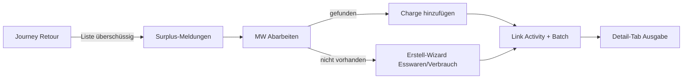

# Überschüssige Lebensmittel / Verbrauchsmaterial bei Rückgabe

**Stand:** 2026-08-16 · Branch `wip/20260816`  
**Ziel:** Gruppe meldet bei Retour Reste (Esswaren/Verbrauch), die **nicht** auf der Packliste standen. MW arbeitet die Liste ab → Suche / ähnlich → Charge hinzufügen oder Erstell-Wizard → Verknüpfung Aktivität ↔ Batch sichtbar im Material-Detail (Tab Ausgabe).

Verwandt (nicht ersetzen): Kistencheck-Überschuss (Inspektion), Werkstatt-Einkauf-Reste, `releaseConsumableSurplus` (API).

---

## User-Flow

1. **Retour (Gruppe / Leader):** Feld «Überschüssiges Material» — Freitext-Zeilen (Name, Menge, optional Ablauf, Hinweis Esswaren/Verbrauch). Speichern erzeugt offene Meldungen + optional Inventur-Task für MW.
2. **Einlagern (MW):** Panel «Überschuss aus Retour» — Zeilen abarbeiten.
3. Pro Zeile: Material suchen (exakt + ähnlich) → **Charge hinzufügen** *oder* **Neu anlegen** (Wizard mit `is_food` / `is_consumable`, Prefill Name/Menge/Ablauf, Herkunft Aktivität).
4. Erledigte Zeile: `resolved_batch_id` (+ ggf. `material_item_id`), Status `resolved`.
5. **Material-Detail → Tab Ausgabe Aktivität/Camp/Event:** Buchungen *und* Surplus-Retour-Chargen (Aktivität, Menge, Datum).

---

## Datenmodell

Tabelle `activity_surplus_report` (Migration `Version20260816150000`):

| Feld | Bedeutung |
|------|-----------|
| `activity_id` | Herkunft Aktivität / Camp / Event |
| `reported_by_user_id` | Melder (Retour) |
| `name_free_text` | Was die Gruppe geschrieben hat |
| `qty` | Menge |
| `kind` | `food` \| `consumable` \| `other` |
| `expiry_date` | optional (Esswaren) |
| `material_item_id` | gesetzt sobald gematcht / neu angelegt |
| `resolved_batch_id` | Charge nach Einlagern |
| `inventory_task_id` | optional MW-Arbeitsliste |
| `status` | `open` → `matched` → `resolved` \| `dismissed` |
| `notes` | frei |

Keine Buchhaltungs-Kostenbuchung bei Esswaren-Resten (bereits über Aktivität bezahlt) — wie beim Esswaren-Anlegen.

---

## UI-Einstiegspunkte

| Schritt | Datei / Ort |
|---------|-------------|
| Melden | `ActivityMaterialJourneyView` bei Journey-Step `return` (neben Verbrauchsmeldung) |
| Abarbeiten | Journey-Step `store` + optional `/tasks` Inventur (`TasksInventoryView`) |
| Suche / Wizard | bestehende Material-Suche + `MaterialCreateWizard` / `BatchModal` mit Prefill + `activity_surplus_report_id` |
| Detail | `MaterialDetailView` Tab `activity-issues` erweitern |

---

## Slice-Reihenfolge

1. **Schema + Entity** — erledigt (diese Migration/Entity)
2. **API** — CRUD Melden / Liste offen / resolve (Batch/Material verknüpfen)
3. **Retour-UI** — Liste erfassen
4. **Store-UI** — Abarbeiten + Deep-Link Wizard/Batch
5. **Detail-Tab** — Surplus-Zeilen anzeigen
6. **Feinschliff** — ähnliche Suche, Benachrichtigung MW, Abgrenzung Kistencheck

---

## Abgrenzung

- **Packlisten-Positionen** bleiben über `quantity_returned` / `quantity_stored`.
- **Neue Reste ohne Packzeile** = Surplus-Report (dieser Spec).
- **Kistencheck qty > erwartet** bleibt Inspektion/Workshop — nicht mit Esswaren-Resten vermischen.
