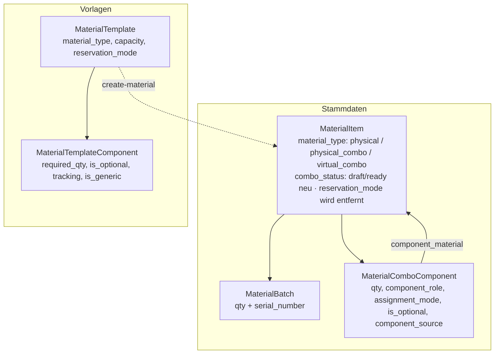

# Kombos (physisch & virtuell)

Konzept-Dokumentation zu **Combo-Materialien** in eMatChef: physische vs. virtuelle Kombo, Stückliste (BOM), Reservationsmodus, optionales Zubehör, Verfügbarkeit/Sperre und der geplante Umbau (Wizard, Vorlagen, Aktivitäten).

**Stand:** Mai 2026 · Zielmodell bereinigt (4 Typen, `reservation_mode` entfällt, Entwurfs-Flag), finaler Umbau offen

---

## 0. Zielmodell (bereinigt) — verbindlich

Diese Übersicht ist der **aktuelle Stand der Entscheidungen** und hat Vorrang vor älteren Formulierungen weiter unten (insb. „Reservationsmodus", „Nur komplett / Mit Optionen").

### Drei Material-Typen (Konfigurator ist KEIN eigener Typ)

| Typ | Beispiel | Kennzeichen |
|-----|----------|-------------|
| **Einzelartikel** | Hering, Stange | ein Material |
| **Physische Kombo** | **Kochkiste**, Zelt fix im Sack, Notfallkoffer | feste Einheit, **zusammen gelagert & ausgegeben**, Seriennummer **fix** gebunden, eigener Batch |
| **Virtuelle Kombo** | „Zelt 8 Pers"; Blachenburgen „Sarasani" / „Berliner" | Teile bleiben einzeln; Seriennummer **erst beim Packen** (`on_issue`). Die **Zusammensetzung** bestimmt das Verhalten (siehe unten) |

**Der Konfigurator ist ein abgeleiteter Zustand der virtuellen Kombo**, kein vierter Typ:

| Zusammensetzung der virtuellen Kombo | Verhalten |
|---|---|
| nur **Basis-Stückliste** | „komplett" (automatisch) |
| zusätzlich **Optionen** (Ja/Nein-Toggle) | beim Buchen Zusatz an/aus |
| zusätzlich **Options-Gruppen** (Entweder-Oder / „1 oder 2") | **Konfigurator** — Abschnitt 6 |

### Ein Modell, ein Pfad (vereinheitlicht — Weg B)

Es gibt **kein** separates „Zubehör"-Konstrukt mehr neben dem Konfigurator. **Alles Wählbare ist eine Option** mit Delta-Liste — `is_optional` ist nur noch **Anzeige-Zucker** desselben Modells:

```
Option = Delta-Liste (±Menge je Teil, je Zeile stock|self_provided)
       + Gruppe & Auswahlregel
       + Anzeige-Modus:  toggle (Ja/Nein, default aus)  |  group (Auswahl exklusiv / Menge n–m)

is_optional  =  abgeleitetes Anzeige-Flag „zeig als Toggle"  (kein eigenes Verhalten)
```

- **Anzeige-Modus ist entkoppelt von den Deltas.** Auch eine Option, die **abzieht** (`−12 Heringe` bei „Ecken entfernen"), darf als **Ja/Nein-Toggle** erscheinen. Nur **Entweder-Oder / „1 oder 2"** braucht zwingend den `group`-Modus (Wahl zwischen Alternativen).
- **Ein einziger Code-Pfad** für Reservierung / Verfügbarkeit / Buchung — immer über die Delta-Mechanik. Additives Zubehör = Sonderfall „nur + Deltas, ungekoppelt".
- **Klemmung:** Würde ein Abzug die Basis unter 0 drücken, wird auf **≥ 0 geklemmt** (bewusst akzeptiert, „auch wenn zu viel rausgeht").
- **Hartsperre gilt auch für Toggles:** Fügt ein Ja/Nein-Zusatz ein nicht verfügbares `stock`-Teil hinzu, wird das Häkchen **gesperrt/ausgegraut** (wie bei Gruppen-Optionen). Reine Abzüge brauchen keine Sperre.

### Kern-Festlegungen

- **Nur 3 Typen.** „Konfigurator-Eigenschaft" ergibt sich daraus, **ob** die Kombo Options-Gruppen (Auswahl-Modus) hat (abgeleitet, höchstens ein Badge fürs Buchungs-UI). Kein eigener `material_type`, kein `is_configurable` bei Erstellung.
- **Datenfundament früh:** Da alles über Optionen/Deltas läuft, muss das Options-/Delta-Schema **schon für den einfachen Ja/Nein-Fall** stehen (Paket 5 zieht es vor, siehe `plan.md`).
- **„Nur komplett" entfällt als Modus** — virtuelle Kombo **ohne** Optionen *ist* komplett.
- **`reservation_mode` entfällt** — Verhalten aus **Typ** + **Zusammensetzung** abgeleitet, kein eigenes Feld.
- **`is_optional`** = nur **Anzeige-Modus „Toggle, default aus"**, nur bei **virtueller Kombo** (physisch nicht; dort = „verwandtes Zubehör" als separate Position).
- **Verwandtes Zubehör** (separate Empfehlungs-Position, **kein** Stücklisten-Teil) gilt für **alle Typen** (physisch und virtuell).
- **Komponenten-Quelle** `stock` | `self_provided` (pro Teile-Zeile, auch auf Delta-Zeilen):
  - `stock` = aus Lager, reserviert, zählt in die Verfügbarkeit (Blachen, Spansets, Seile, Heringe).
  - `self_provided` = **vom Leiter selbst zu organisieren** (z. B. Mast): **nicht** reserviert, **nicht** im Flaschenhals — erscheint nur als Checklisten-/Hinweis-Posten beim Packen/Aufbau.
- **Jede Kombo hat ≥ 1 `stock`-Teil** (Pflicht). „Alles self_provided" ist nicht erlaubt — `self_provided` ist immer nur Beigabe zu echten Lagerteilen.
- **`ready`-Validierung = Verfügbarkeit der Gesamtmenge:** Beim Fertigstellen/Buchen muss die **gesamthaft benötigte Menge der `stock`-Teile** (Flaschenhals über alle Pflichtteile × gewünschte Stückzahl) verfügbar sein.
- **Entwurfs-Flag „in Bearbeitung":** Kombo wird im Wizard als **Hülle** angelegt (Status `draft`) und erst im **Detail-Tab** fertiggestellt (Status `ready`). Solange `draft`: Badge „in Bearbeitung", **nicht buchbar**. (✅ umgesetzt: `MaterialItem.combo_status`, Migration `Version20260529120000`.)
- **Erfassung:** Wizard = nur das Nötigste (Typ, Name, Kategorie, ggf. Basisteile). Stückliste / Optionen → **Detail-Tab** (Zusammensetzung). Vorlagen-Editor spiegelt dieselbe Struktur.

---

## 1. Die zwei Combo-Typen

| | **Physische Kombo** (z. B. „Zelt #3", „Zelt fix im Sack") | **Virtuelle Kombo** (z. B. „Zelt 8 Personen") |
|---|---|---|
| Bedeutung | Ein dauerhaft zusammengebautes, **serialisiertes Einzelstück** | **Planungs-/Reservierungsgruppe**, Teile bleiben einzeln |
| Eigener Bestand? | **Ja** – eigener `MaterialBatch` (qty 1, serialisiert) | **Nein** – `total_stock = 0`, Bestand nur über Komponenten |
| Komponenten | `assignment_mode: fixed`, Batch fest gebunden | `assignment_mode: on_issue` (serial.) / `bulk` |
| Seriennummer-Bindung | **fix bei Erstellung** | **erst beim Packen/Ausgeben** (`on_issue`) |
| Sperre bei Buchung | sperrt **die Kombo-Einheit** (ihren Batch) | muss **die Komponenten-Mengen** sperren (kaskadiert) |
| Teile einzeln buchbar? | nein (im Set verbaut) | Pflichtteile fix, Zubehör (`is_optional`) wählbar — siehe Abschnitt 0 |
| Behälter | optional `linked_container_batch` (Sack/Kiste als Referenz) | nicht an physische Kiste gebunden |

**Kernaussage:** Bei der physischen Kombo ist die Sperre trivial (1 Batch = 1 Einheit). Bei der virtuellen Kombo gibt es **keinen** eigenen Bestand – die Sperre muss **auf die geteilten Komponenten durchschlagen**.

### Wann welcher Typ?

- **Physisch:** Set bleibt dauerhaft zusammen (Sack mit Aussen-/Innenzelt/Stangen, versiegelter Notfallkoffer, fest verbaute Maschine).
- **Virtuell:** Teile werden geteilt/umkonfiguriert. Beispiel: dasselbe Aussenzelt kann in „Zelt 8 Pers" **oder** „Zelt 16 Pers" laufen. Physisch würde das Aussenzelt für immer in *ein* Set eingesperrt – virtuell zieht man beide Konfigurationen aus demselben freien Teile-Pool.

> Wichtig: Auch eine virtuelle Kombo **ohne Zubehör** liefert ein **komplettes** Zelt – nur dass das konkrete serialisierte Teil erst beim Packen zugewiesen wird. „Komplett" zwingt also **nicht** zur physischen Kombo. (Es gibt keinen eigenen Modus „Nur komplett" mehr — siehe Abschnitt 0.)

---

## 2. Datenmodell



### `MaterialComboComponent` – die Stückliste

| Feld | Bedeutung |
|------|-----------|
| `qty` | Menge (serialisiert immer 1, bulk z. B. 24 Heringe) |
| `component_role` | Rolle: `aussenzelt`, `innenzelt`, `heringe`, … |
| `assignment_mode` | `fixed` / `assigned` / `on_issue` / `bulk` |
| `is_optional` | **Anzeige-Flag** „als Ja/Nein-Toggle zeigen, default aus" (siehe Abschnitt 0; **kein** eigenes Verhalten, Verhalten kommt aus der Delta-Liste der Option) |
| `component_source` *(neu)* | `stock` (aus Lager, reserviert) vs. `self_provided` (Leiter bringt selbst, z. B. Mast — nicht reserviert) |
| `component_batch_id` | konkrete Seriennummer (NULL bei `on_issue`/`bulk`) |

> **Vereinheitlichtes Options-Modell (Weg B, Zielbild):** Alles Wählbare läuft über **Optionen mit Delta-Listen** (neue Tabellen, Abschnitt 6) — `is_optional` ist nur die degenerierte Toggle-Variante davon. Auch abziehende Optionen dürfen als Toggle erscheinen; nur Entweder-Oder braucht den Gruppen-Modus.

**Zuweisungsmodi:**
- `fixed` – physische Kombo, dauerhaft verbaut (Batch fest)
- `assigned` – virtuelle Kombo, bei Erstellung zugewiesen (tauschbar)
- `on_issue` – virtuelle Kombo, Batch erst beim Packen/Ausgeben (`isAwaitingAssignment()`)
- `bulk` – nur Menge, keine Seriennummer

### Was die Vorlage liefert

`MaterialTemplate`: `material_type`, `tent_type`, `capacity`, `reservation_mode`.
`MaterialTemplateComponent`: `component_type`, `required_qty`, **`is_optional`**, `tracking` (serialized/bulk), `is_generic`, `sort_order`. Diese Struktur fließt 1:1 in die `MaterialComboComponent` der erzeugten Kombo.

---

## 3. Reservationsmodus

Gespeichert auf `MaterialItem.reservation_mode` (und `MaterialTemplate`). Dokumentierte Werte: `complete_only`, `individual`, `flexible`.

### Aktueller Stand (wichtig)

Der Wert wird **nur gesetzt und in der API-Response zurückgegeben** – er fließt in **keine** Verfügbarkeits- oder Buchungslogik ein (kein Vorkommen in den Availability-/Activity-Controllern). Aktuell also reine Deklaration ohne Wirkung.

### Entscheidung: `reservation_mode` entfällt ⚠️ (überholt den früheren Reframe)

> Diese Sektion ist historisch. **Aktueller Stand: `reservation_mode` wird gestrichen** (siehe Abschnitt 0).

Der Zwischenschritt war, das Trio `complete_only / individual / flexible` auf „Nur komplett / Mit Optionen" einzudampfen. Inzwischen entschieden: **gar kein eigenes Modus-Feld**. Begründung:
- „Nur komplett" = einfach eine virtuelle Kombo **ohne** Optionen → ergibt sich automatisch.
- „Mit Optionen" = virtuelle Kombo **mit** Optionen (Toggle/Gruppe).
- Freie Zusammenstellung = **Konfigurator** = abgeleiteter Zustand der virtuellen Kombo (kein eigener Typ — siehe Abschnitt 0).

Das Verhalten leitet sich also aus **Material-Typ** + **Vorhandensein von Zubehör/Optionen** ab; `reservation_mode` (heute ohne Wirkung) wird nicht weiterentwickelt, sondern entfernt. `individual` war ohnehin sinnlos.

---

## 4. Optionales Zubehör (`is_optional`)

- Das „Zubehör"-Feld heißt im Code **`is_optional`** (kein separates `is_accessory`). Beispiel aus der Vorlagen-Doku: „Tortuga Bodendecke".
- **Bug (offen):** Der „optional"-Haken wird im Zusammensetzungs-Tab (`MaterialDetailView.vue`) für **beide** Combo-Typen angezeigt – auch für physische Kombos, wo er **keinen Sinn** ergibt (fixes, als Ganzes reserviertes Einzelstück). Der `assignment_mode` wird dort schon typabhängig vorbelegt (`virtual_combo → on_issue`, sonst `bulk`), nur `is_optional` wurde vergessen.
- **Soll:**

| Combo-Typ | Komponenten | „optional"-Frage? |
|---|---|---|
| **physisch** | alle `fixed` | **nein** – ausblenden (Zubehör = separate „verwandtes Zubehör"-Position) |
| **virtuelle Kombo** | Pflicht + optional | **ja** – Zubehör hier; ohne Zubehör = automatisch „komplett" |
| **Konfigurator** | Basis + Optionen/Deltas | über Options-Gruppen (Abschnitt 6) |

---

## 5. Konfigurierbare Zelte (zwei reale Fälle)

| Fall | Beispiel | Combo-Typ | Status |
|------|----------|-----------|--------|
| **Fix im Sack** | Aussen + Innen + Stangen dauerhaft zusammen | physische Kombo (Sack = `linked_container_batch`) | **voll abgebildet** |
| **Variabel** | 1 Aussenzelt, wahlweise 1/2 Innenzelte oder Aufstelleinheit – mit anderen Heringen/Schnüren/Stangen | virtuelle Kombo mit **variabler** Stückliste | **Lücke** |

### Grenze von `is_optional` (historische Analyse — durch Weg B gelöst)

> **Hinweis:** Diese Grenze galt für den *alten* eigenständigen `is_optional`-Bool. Im vereinheitlichten Options-Modell (Weg B, Abschnitt 0/6) ist `is_optional` nur noch Anzeige-Flag; die zugrundeliegende **Option mit Delta-Liste** kann sehr wohl abhängige Mengen (±Delta) und — über den `group`-Modus — Entweder-Oder abbilden.

Der *alte* `is_optional` war nur ein **unabhängiger** Ja/Nein-Haken pro Zeile. Er konnte **nicht**:
- **abhängige Mengen** („2. Innenzelt → +12 Heringe, längere Schnüre, +4 Stangen"),
- **Entweder-Oder** („Innenzelt-Variante **oder** Aufstelleinheit").

### Drei Lösungswege für den variablen Fall

| Weg | Idee | Heute machbar? | Aufwand |
|-----|------|----------------|---------|
| **A) Variante = eigene Kombo** | „Zelt 8 Pers" / „Zelt 16 Pers" je mit fester Stückliste, gemeinsamer Teile-Pool | **Ja** | klein |
| **B) Eine Kombo + `is_optional`** | Pflichtteile + unabhängige optionale Zeilen | teilweise – keine Mengen-Abhängigkeit/Ausschluss | mittel |
| **C) Varianten-BOM (Konfigurator)** | Options-Gruppen mit gekoppelten Unter-Stücklisten | **Nein** – neues Datenmodell | groß |

**Entscheidung:** Für die variablen Zelte wird **Weg C (Konfigurator)** gebaut – siehe Abschnitt 6. Feste Sets bleiben physische Kombos oder virtuelle Kombos ohne Zubehör (Mix). Weg A bleibt als pragmatische Abkürzung für rein diskrete Konfigurationen möglich.

---

## 6. Konfigurator-Modell (Zielbild für variable Kombos)

Für variable Kombos (Zelte mit 1/2 Innenzelten, „Hochstelleinheit **oder** Vorzelt", „Ecken entfernen Schnüre/Heringe"; Blachenburgen „Sarasani"/„Berliner") wird ein **Konfigurator** gebaut: eine virtuelle Kombo, deren Stückliste sich aus der Auswahl ergibt.

> **Kein eigener Typ, ein Modell:** Der Konfigurator ist der **erweiterte Zustand** einer virtuellen Kombo (Abschnitt 0). **Alles Wählbare ist eine Option mit Delta-Liste** — auch das einfache „Zubehör" (`is_optional`) ist nur eine Option im Anzeige-Modus `toggle`. Es gibt **keinen zweiten Mechanismus**.

### Delta-Modell

```
Endgültige Stückliste = Basis-Teile
                       + Σ (gewählte Optionen × ihr Delta)     (geklemmt auf ≥ 0)
```

Bausteine – **in Kombo UND Vorlage**:

| Baustein | Inhalt | Beispiel |
|---|---|---|
| **Basis-Stückliste** | immer dabei, feste Menge | 1 Aussenzelt, Grundschnüre, Grundheringe |
| **Options-Gruppe** | Name, Auswahltyp, min/max | „Innenzelt" (1–2); „Aufbau" (genau 1: Hochstell \| Vorzelt) |
| **Option** | **Anzeige-Modus** (`toggle` Ja/Nein \| `group` Auswahl) + **Delta-Stückliste** je Wahl: Liste von (Teil, **±Menge**, `stock\|self_provided`) | „Vorzelt? ja/nein" → +1 Vorzelt; „Ecken? ja/nein" → +4 Stangen, **−12 Heringe** |

Deckt ab: Module/Addition (positive Deltas), Entweder-Oder (exklusive Gruppe), Subtraktiv (negative Deltas), einfaches Zubehör (Toggle, default aus).

**Anzeige-Modus ist entkoppelt von den Deltas:** Auch eine **abziehende** Option darf als **Ja/Nein-Toggle** erscheinen („auch wenn zu viel rausgeht" → Klemmung auf ≥ 0). Nur **Entweder-Oder / „1 oder 2"** erzwingt den `group`-Modus. `is_optional` ist damit nur das abgeleitete Flag „zeig als Toggle".

**Komponenten-Quelle** (auf jeder Teile-Zeile, Basis wie Delta): `stock` (aus Lager, reserviert, zählt im Flaschenhals) oder `self_provided` (vom Leiter zu organisieren, z. B. **Mast** bei Blachenburgen — **nicht** reserviert, **nicht** im Flaschenhals, nur Checklisten-/Hinweis-Posten beim Packen/Aufbau). **Jede Kombo braucht ≥ 1 `stock`-Teil.**

### Datenbank-Schema (Detail) — verbindlich für Paket 5

Vier Tabellen für die Kombo, **gespiegelt** für die Vorlage (`material_template_*`). Basis bleibt in der bestehenden `material_combo_component` (nur um `component_source` erweitert).

**`material_combo_component`** — Basis-Stückliste (bestehend, erweitert)

| Spalte | Typ | Bedeutung |
|---|---|---|
| `id` | CHAR(13) PK | |
| `material_item_id` | CHAR(12) FK → `material_item` | die Kombo |
| `component_material_id` | CHAR(12) FK → `material_item` | das Bauteil |
| `qty` | INT | feste Basismenge (immer dabei) |
| `component_role` | VARCHAR(40) NULL | `aussenzelt`, `heringe`, … |
| `assignment_mode` | VARCHAR(20) | `on_issue` / `bulk` (virtuell) |
| `tracking` | VARCHAR(20) NULL | `serialized` / `bulk` |
| `component_source` *(neu)* | VARCHAR(20) default `stock` | `stock` \| `self_provided` |
| `sort_order` | INT default 0 | |

**`material_combo_option_group`** — Auswahl-Gruppen (neu)

| Spalte | Typ | Bedeutung |
|---|---|---|
| `id` | CHAR(13) PK | |
| `material_item_id` | CHAR(12) FK → `material_item` | die Kombo |
| `name` | VARCHAR(120) | z. B. „Innenzelt", „Aufbau" |
| `selection_type` | VARCHAR(20) | `exclusive` (genau 1) \| `multi` (mehrere) \| `quantity` (n–m Stück) |
| `min_select` | INT default 0 | Untergrenze (z. B. 1 = Pflichtwahl) |
| `max_select` | INT NULL | Obergrenze (NULL = unbegrenzt) |
| `sort_order` | INT default 0 | |

**`material_combo_option`** — die einzelne Option (neu)

| Spalte | Typ | Bedeutung |
|---|---|---|
| `id` | CHAR(13) PK | |
| `material_item_id` | CHAR(12) FK → `material_item` | die Kombo (Redundanz für einfache Queries) |
| `option_group_id` | CHAR(13) FK → `…_option_group` **NULL** | NULL = eigenständige Option (kein Gruppenzwang) |
| `name` | VARCHAR(120) | z. B. „Vorzelt", „2. Innenzelt", „Ecken entfernen" |
| `display_mode` | VARCHAR(20) | `toggle` (Ja/Nein) \| `group` (Auswahl) — **entkoppelt von den Deltas** |
| `default_selected` | BOOL default false | Vorauswahl (Toggle default aus = false) |
| `sort_order` | INT default 0 | |

**`material_combo_option_delta`** — ±Stückliste je Option (neu)

| Spalte | Typ | Bedeutung |
|---|---|---|
| `id` | CHAR(13) PK | |
| `option_id` | CHAR(13) FK → `…_option` | zu welcher Option |
| `component_material_id` | CHAR(12) FK → `material_item` | welches Teil |
| `qty_delta` | INT (signed) | **±Menge** (z. B. `+1`, `−12`) |
| `assignment_mode` | VARCHAR(20) | `on_issue` / `bulk` |
| `tracking` | VARCHAR(20) NULL | `serialized` / `bulk` |
| `component_source` | VARCHAR(20) default `stock` | `stock` \| `self_provided` |
| `sort_order` | INT default 0 | |

**Regeln & Hinweise**
- **Vorlagen spiegeln 1:1:** `material_template_option_group`, `material_template_option`, `material_template_option_delta` (Bauteil-Bezug über `component_type`/Vorlagen-Konvention statt konkretem `material_item`).
- **Toggle = degenerierte Option:** `display_mode = toggle`, `option_group_id = NULL`, eine `…_option_delta`-Zeile (`qty_delta = +1`). `is_optional` der Komponente wird durch genau diese Form ersetzt/abgeleitet.
- **Endmenge je Teil** (Auflösung): `Σ basis.qty + Σ (gewählte option.delta.qty_delta)`, pro Teil **auf ≥ 0 geklemmt**.
- **Kaskaden:** `ON DELETE CASCADE` von Kombo → Gruppen/Optionen/Deltas. Löschen einer Gruppe setzt `option.option_group_id` NULL **oder** löscht die Gruppen-Optionen (Entscheidung im Migrations-Detail).
- **`self_provided`** zählt nie in Flaschenhals/Reservierung — nur Checklisten-Posten.

### Verfügbarkeit pro Option (hart gesperrt)

Buildbarkeit wird **je Option** gerechnet – Flaschenhals ihrer Teile auf dem gemeinsamen Pool im gewählten Zeitraum:

```
baubar(Option) = min über Teile_der_Option ( floor( frei(Teil) / benötigt_pro_Option ) )
```

- **Pro-Wahl-Badge** live (verfügbar / nicht verfügbar).
- **Exklusive Gruppe:** nicht verfügbare Wahl **ausgrauen** + zur verfügbaren Alternative lenken („Hochstell nicht frei – Vorzelt nehmen?").
- **Mengen-Wahl** begrenzt durch frei (2 Innenzelte nur, wenn 2 frei).
- **Gesamt „baubar"** hängt von der gewählten Konfiguration ab (andere Auswahl → anderer Flaschenhals).
- **Menge × Konfiguration:** bei 3 Zelten muss jede Option × 3 frei sein.
- **Hart sperren** (entschieden): nicht im Zeitraum verfügbar = nicht wählbar, konsistent mit dem bestehenden `canAdd` für einfache Materialien. (Kein „warnen-aber-erlauben".)
- **Gilt auch für Ja/Nein-Toggles:** Fügt ein Toggle ein nicht verfügbares `stock`-Teil **hinzu**, wird das Häkchen gesperrt/ausgegraut. Reine **Abzüge** brauchen keine Sperre (sie geben Bestand frei). `self_provided`-Teile zählen nie in die Sperre.

### Set-Anzeige nach Buchung

Die gebuchte virtuelle Kombo wird **gruppiert wie eine Kiste** dargestellt (Hülle + aufgelöste Teile als Inhalt) – analog `activity_pack_container`, aber logisch statt physisch. Umsetzung über **Zeilenmodell B** (Abschnitt 7): Kind-Zeilen (`parent_activity_item_id`) hängen an der Eltern-/Kombo-Zeile.

### Verwandtes Zubehör (separat, unabhängig)

Eigene Empfehlungs-Verknüpfung (Kombo → andere Materialien), **getrennt** von der Stückliste, verwaltet im Zusammensetzungs-Tab (`MaterialDetailView`). Im Aktivitäts-Flow als Vorschlag „Zubehör dazu?" → **eigene Positionen** (nicht Teil des Sets). Auch für **physische** Kombos nutzbar.

> ✅ **Umgesetzt (Paket 4):** Entity `MaterialRelatedAccessory` (Migration `Version20260529140000`) + CRUD `/api/materials/{id}/related-accessories`; Verwaltung im Zusammensetzungs-Tab; Vorlagen führen Zubehör über `MaterialTemplateRelatedAccessory` mit und lösen es beim „Vorlage → Material" zu konkreten Verknüpfungen auf; Aktivitäts-Lookup schlägt nach dem Hinzufügen einer Kombo das verfügbare Zubehör als eigene Positionen vor.

### Phasen

| Phase | Inhalt |
|-------|--------|
| **0** | Verwandtes Zubehör (unabhängig, sofort nützlich) |
| **1** | Basis + Options-Gruppen + **positive** Deltas + Exklusivität + Verfügbarkeit pro Option (hart) |
| **2** | **negative** Deltas (Ecken entfernt Teile) |
| **3** | Set-Anzeige wie Kiste + „Kombinieren?"-Dialog |

Vorlagen (`MaterialTemplate*`) ziehen pro Phase mit – Gruppen/Optionen/Delta-Listen auch im `TemplateEditDialog` und im „Vorlage → Material"-Pfad.

---

## 7. Verfügbarkeit & Sperre (virtuelle Kombo)

### Verfügbarkeit = Flaschenhals der Komponenten

Da die virtuelle Kombo keinen eigenen Bestand hat:

```
verfügbare_Kombos = min über k ( floor( frei(Komponente_k) / menge_pro_kombo_k ) )
```

Beispiel „Zelt 8 Pers" = 1 Plane + 12 Stangen + 24 Heringe; frei: 4 Planen, 40 Stangen, 100 Heringe →
`min(4/1, 40/12, 100/24) = 3 Zelte` (Stange ist der Engpass).

### Sperre kaskadiert auf Komponenten

Buchung von 3× „Zelt 8 Pers" sperrt im Zeitraum 3× Plane, 36× Stange, 72× Hering.

**Entscheidung: Zeilenmodell B (hybrid) — Eltern-Zeile + Kind-Zeilen.** Die Kombo erzeugt:
- **eine Eltern-`activity_item`-Zeile** (`material_item_id` = Kombo, `quantity` = Anzahl Kombos) → speichert die **gewählte Konfiguration als Snapshot** (für Anzeige/Bearbeitung; Set-Anzeige „wie Kiste"),
- **pro aufgelöstem `stock`-Teil eine Kind-`activity_item`-Zeile** (`material_item_id` = Komponente, `quantity` = Endmenge × Kombo-Anzahl, `parent_activity_item_id` = Eltern-Zeile) → das ist die **echte Reservierung**.

**Warum B:** Die bestehende Reservierungs-SQL summiert `activity_item.quantity` pro `material_item_id` (`MaterialAvailabilityReservationQuery::lateralReservedQtySql`). Kind-Zeilen werden damit **ohne SQL-Umbau** korrekt gezählt — das schließt genau die Lücke „Kombo reserviert faktisch nichts" (Abschnitt 8). Die Eltern-Zeile hält die Bestellung lesbar.

- `self_provided`-Teile erzeugen **keine** Reservierungs-Kind-Zeile, nur einen Hinweis-/Checklisten-Eintrag.
- Konfig ändern = Kind-Zeilen neu generieren (Eltern-Zeile bleibt, Snapshot aktualisieren).
- Benötigt **neu:** `activity_item.parent_activity_item_id` (NULL = normale/Eltern-Zeile) + Snapshot-Feld (z. B. `config_snapshot` JSON) an der Eltern-Zeile.

### Geteilter Pool

Komponenten sind eigenständige Materialien und können in mehreren Kombos vorkommen. Verfügbarkeit **immer live** aus dem gemeinsamen Pool – nie pro Kombo statisch vorberechnen.

### Seriennummer erst beim Packen

Beim Buchen wird nur die **Menge** reserviert (Verfügbarkeit = Menge × Zeitraum). Das **konkrete serialisierte Teil** wählt/scannt der MW erst beim Packen (`on_issue`). Das beeinflusst die Verfügbarkeit nicht (Menge ist schon gezählt).

### Bezug zur bestehenden Pipeline

Reservierung/Sperre folgen den zwei Ebenen aus
[../../activities/material-pipeline.md](../../activities/material-pipeline.md):
1. Bestell-Reservierung (`draft…approved`): `activity_item.quantity` bei Zeitraum-Overlap.
2. Physische Sperre (`packing…returned`): `GREATEST(packed, returned) − stored`.

Für virtuelle Kombos müssen beide Ebenen **auf Komponenten-Ebene** greifen (Pack-Positionen pro Komponente, da die Kombo keine Batches hat).

### Zeitraumbasiert (entschieden)

Fremde Reservierungen zählen **nur bei Zeitraum-Überlappung** (`MaterialAvailabilityReservationQuery::lateralReservedQtySql`, `periodOverlapSql`). Die eigene Aktivität wird über `excludeActivityId` ausgeklammert. Daraus die vier Fälle für ein Teil (z. B. Aufstelleinheit):

| Situation | Verfügbar? | Aktion |
|---|---|---|
| Schon in **eigener** Aktivität | ja (ausgeklammert) | **„kombinieren?" fragen** |
| Fremde Aktivität, **anderer** Zeitraum | ja | normal buchbar, kein Konflikt |
| Fremde Aktivität, **überlappender** Zeitraum (Bestellung) | nein | echter Engpass |
| Fremde Aktivität, schon **gepackt** (`packing…returned`) | nein | physisch weg – **unabhängig vom Zeitraum** |

**Ausnahme vom Zeitraum-Prinzip:** gepacktes Material ist physisch nicht im Regal → gesperrt, egal welcher Zeitraum (zweite Sperr-Ebene).

### Kombinieren statt doppelt reservieren (Feature, offen)

Wenn ein Kombo-Bestandteil (z. B. Aufstelleinheit als Option) dasselbe Teil ist wie eine **bereits in derselben Aktivität** vorhandene Position, soll die App **nicht** stumpf eine zweite Einheit reservieren, sondern den Überlapp erkennen und **den User fragen**, ob die vorhandene Einheit für die Kombo verwendet wird. Verhindert Doppelbuchung *innerhalb* der Aktivität. Grundlage (`excludeActivityId`) ist vorhanden, der Dialog/die Verknüpfung nicht.

---

## 8. Implementierungs-Lücken (Ist-Zustand)

- [ ] Verfügbarkeits-SQL löst virtuelle Kombo **nicht** in Komponenten auf → Buchung einer virtuellen Kombo reserviert faktisch nichts.
- [ ] `reservation_mode` wird **nicht** konsumiert (nur gespeichert/angezeigt).
- [ ] Kein `on_issue`-Auflösungs-Flow beim Packen (keine Pick-/Scan-Liste für serialisierte Teile der virtuellen Kombo).
- [x] **Behoben (Paket 0):** `is_optional`-Haken bei physischen Kombos ausgeblendet.
- [ ] Kein Varianten-/Konfigurator-BOM (abhängige Mengen, Entweder-Oder).
- [ ] Kein „Kombinieren?"-Dialog bei Überlapp einer Kombo-Option mit vorhandener Aktivitäts-Position.
- [x] **Umgesetzt (Paket 1):** Entwurfs-Flag `combo_status` (draft/ready) auf `MaterialItem` inkl. Migration, Create→draft, `finalize-combo`, Draft-Ausschluss in der Verfügbarkeit, Badge.
- [ ] `reservation_mode` noch vorhanden (in Wizard/Detail/Vorlage), soll **entfernt** werden (Paket 2).
- [x] **Behoben:** Wert-Inkonsistenz im Wizard – erster Reservationsmodus-Block nutzte `individual_parts` statt `individual` (jetzt einheitlich `individual`).

---

## 9. Entscheidungen

### Entschieden

1. **Combo-Typen:** Physische Kombo **nur** für Sets, die **zusammen gelagert und ausgegeben** werden. Alles Variable → virtuelle Kombo / Konfigurator.
2. **Variable Zelte:** **Konfigurator (Weg C) + feste Kombos (Mix)** – Modell entworfen (Abschnitt 6, Delta-Modell). Phasenweise bauen.
3. **`reservation_mode`:** **entfällt komplett** (Verhalten abgeleitet) — siehe Punkt 8. (Frühere Idee „Nur komplett / Mit Optionen" überholt.)
4. **Verfügbarkeit zeitraumbasiert** (siehe Abschnitt 7) mit Pipeline-Ausnahme „gepackt".
5. **Kombinieren-mit-Nachfrage** als Feature (siehe Abschnitt 7).
6. **Konfigurator = Delta-Modell** (Basis + Options-Gruppen + Optionen mit ±Delta), Verfügbarkeit **pro Option**, nicht verfügbare Option **hart gesperrt** (siehe Abschnitt 6).
7. **Verwandtes Zubehör** als separate Empfehlungs-Verknüpfung (nicht `is_optional`), Phase 0.
8. **Drei Typen** (Einzel/physisch/virtuell); **`reservation_mode` entfällt**; „Nur komplett" leitet sich ab (siehe Abschnitt 0).
9. **Konfigurator = abgeleiteter Zustand** der virtuellen Kombo (kein eigener Typ, kein `is_configurable`): bestimmt durch die **Zusammensetzung** (Button „Delta/Optionen"). → ersetzt früheren offenen Punkt #2.
10. **Komponenten-Quelle** `stock` | `self_provided` (Mast & Co.: nicht reserviert, nur Checkliste). **Jede Kombo braucht ≥ 1 `stock`-Teil** („alles self_provided" verboten).
11. **Entwurfs-Flag** `draft/ready` (neu auf `MaterialItem`): Wizard legt `draft` an, Detail-Tab stellt fertig; `draft` = „in Bearbeitung", nicht buchbar.
12. **Erfassung geteilt:** Wizard = Hülle (Typ/Name/Kategorie/Basisteile), Detail-Tab (Zusammensetzung) = Stückliste/Optionen/Deltas; Vorlagen-Editor spiegelt die Struktur.
13. **Ein vereinheitlichtes Options-Modell (Weg B):** Alles Wählbare ist eine **Option mit Delta-Liste**; `is_optional` ist nur **Anzeige-Flag „Toggle"**. **Anzeige-Modus (toggle/group) ist entkoppelt von den Deltas** — auch abziehende Optionen dürfen Ja/Nein sein; nur Entweder-Oder erzwingt `group`. Folge: Options-/Delta-Schema wird **früh** gebraucht (kein billiger Bool-Zwischenschritt).
14. **Klemmung ≥ 0** bei Abzügen (bewusst akzeptiert) und **Hartsperre auch für Toggles**, die nicht verfügbare `stock`-Teile hinzufügen.
15. **`ready`-Validierung = Gesamtmenge:** Fertigstellen/Buchen verlangt, dass die **gesamthaft benötigte Menge der `stock`-Pflichtteile** im Zeitraum verfügbar ist (Flaschenhals × Stückzahl).
16. **Verwandtes Zubehör für alle Typen** (physisch und virtuell), separate Empfehlungs-Position.
17. **Direktbuchungs-Schutz = A (kein Schutz, Default):** virtuelle Kombo ist nur Buchungs-Gruppierung; Komponenten bleiben einzeln buchbar. Der Bestandskonflikt ist schon über die Verfügbarkeits-SQL gelöst; ein optionales Schutz-Flag (B) kann später nachgerüstet werden.
18. **DB-Schema Optionen/Deltas = definiert** (Abschnitt 6 „Datenbank-Schema (Detail)"): `material_combo_option_group`, `material_combo_option`, `material_combo_option_delta` + `component_source` auf der Basis-Stückliste; gespiegelt als `material_template_*`.
19. **Zeilenmodell Aktivität = B (hybrid):** Eltern-`activity_item` (Kombo + Konfig-Snapshot) + Kind-Zeilen pro `stock`-Teil (`parent_activity_item_id`); nutzt die bestehende Reservierungs-SQL (Abschnitt 7).

### Noch offen

- *(keine offenen Grundsatzentscheidungen mehr — Detailfragen werden im jeweiligen Migrations-/Implementierungsschritt geklärt: Index-/Kaskaden-Details, genaues JSON-Format des Konfig-Snapshots.)*

---

## 10. Roadmap – finaler Umbau

### A) Wizard „Material erstellen" (nur das Nötigste)
- **Drei Typen** klar anbieten: Einzelartikel · Physische Kombo · Virtuelle Kombo. **Konfigurator ist kein eigener Typ** (ergibt sich aus der Zusammensetzung).
- `reservation_mode` **entfernen** (Verhalten abgeleitet, siehe Abschnitt 0).
- `is_optional` (Zubehör) nur bei virtueller Kombo (physisch ausblenden).
- Wizard legt Kombo als **Hülle** an → Status `draft` („in Bearbeitung"); Stückliste/Optionen im Detail-Tab.
- Neues **Entwurfs-Flag** `draft/ready` auf `MaterialItem` (+ Migration); `draft` nicht buchbar.

### B) Detail-Tab & Vorlagen
- **Detail-Tab (`MaterialDetailView`):** Stückliste, Zubehör (`is_optional`), Komponenten-Quelle (`stock`/`self_provided`), Button „Delta/Optionen" → Konfigurator-Gruppen/Optionen/±Deltas, verwandtes Zubehör; „fertigstellen" setzt `ready`.
- **Vorlagen-Editor:** spiegelt dieselbe Struktur (Pflicht/Zubehör, Quelle, Gruppen/Optionen/Deltas); `is_optional` / `component_source` / `required_qty` / `tracking` korrekt in die erzeugte Kombo übertragen.

### C) Aktivitäten – Bestellen & Zusammensetzen
- **Bestellen:** virtuelle Kombo hinzufügen → Verfügbarkeit als Flaschenhals der `stock`-Komponenten; Zubehör-Teile wählbar; `self_provided`-Teile als Hinweis; Sperre kaskadiert auf Komponenten-Mengen × Zeitraum. Nur `ready`-Kombos buchbar.
- **Anzeige:** „noch X× verfügbar" pro Kombo (statt X-mal klicken).
- **Kombinieren:** Überlapp einer Kombo-Option mit vorhandener Position erkennen → User fragen, ob vorhandene Einheit verwendet wird (statt doppelt reservieren).
- **Packen (MW):** Pick-/Scan-Liste pro `on_issue`-Komponente → konkrete Seriennummer zuweisen (`component_batch_id` setzen, `isAwaitingAssignment()` wird false).
- **Pipeline:** Pack-/Sperr-Positionen pro Komponente führen.

---

## 11. Code-Referenzen

| Thema | Ort |
|-------|-----|
| Combo-Material | `backend/src/Entity/MaterialItem.php` (`material_type`, `reservation_mode`) |
| Stückliste | `backend/src/Entity/MaterialComboComponent.php` |
| Vorlage | `backend/src/Entity/MaterialTemplate.php`, `MaterialTemplateComponent.php` |
| Combo-CRUD / Komponenten | `backend/src/Controller/MaterialController.php` |
| Vorlage → Material | `backend/src/Controller/TemplateController.php` |
| Verfügbarkeit / Sperre | `backend/src/Controller/MaterialAvailabilityController.php`, `backend/src/Service/MaterialAvailabilityReservationQuery.php` |
| Wizard | `frontend/src/components/material/MaterialCreateWizard.vue` |
| Detail / Zusammensetzung | `frontend/src/components/material/MaterialDetailView.vue` |
| Vorlagen-Editor | `frontend/src/components/template/TemplateEditDialog.vue` |

---

## Siehe auch

- [plan.md](./plan.md) — **Umbauplan / Checkliste** (Pakete 0–7)
- [Material-Pipeline (Aktivitäten)](../../activities/material-pipeline.md)
- [Aktivitäts-Status](../../activities/status.md)
