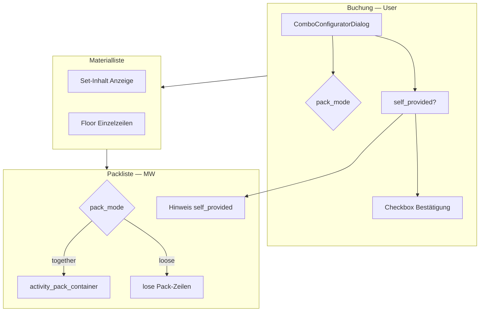

# Virtuelle Kombo in Aktivitäten

Spezifikation für **Materialplanung**, **Buchung** und **Packen** virtueller Kombos in Aktivitäten — ergänzt das Stammdaten-Konzept in [README.md](./README.md) (Abschnitte 6–7) um den **Aktivitäts- und Pack-Flow**.

**Stand:** Juni 2026 · **Status:** Material-Set-Anzeige umgesetzt; `pack_mode`, Pack-Container und Ersteller-Bestätigung für `self_provided` **geplant**

**Verwandt:** [README.md](./README.md) · [plan.md](./plan.md) · [material-pipeline.md](../../activities/material-pipeline.md) · [pack-workflow-rules.md](../../activities/pack-workflow-rules.md) · [pack-step-ui.md](../../activities/pack-step-ui.md)

---

## 1. Grundprinzip

Eine virtuelle Kombo ist in Aktivitäten **kein packbares Einzelstück**. Sie ist eine **Planungs- und Gruppierungseinheit**:

| Ebene | Was passiert |
|-------|----------------|
| **Reservierung** | Nur **`stock`-Komponenten** als Kind-`activity_item`-Zeilen (Zeilenmodell B) |
| **Anzeige Materialliste** | Eltern-Zeile (Kombo + `config_snapshot`) + Set-Inhalt; Kind-Zeilen ausgeblendet |
| **Packliste** | **Nur Einzelartikel** — keine virtuelle Kombo-Zeile; Verhalten über `pack_mode` |

`self_provided`-Teile (z. B. Mast) sind **überall nur Hinweis/Checkliste** — nie reserviert, nie packbar, nie in einer Packkiste.

---

## 2. Zeilenmodell B (Ist — Buchung)

Bereits umgesetzt; siehe [README.md Abschnitt 7](./README.md#7-verfügbarkeit--sperre-virtuelle-kombo).

```
activity_item (Eltern)
  material_item_id = virtual_combo
  quantity = Anzahl Sets
  config_snapshot = { selected_option_ids, resolved_components, self_provided, … }

activity_item (Kind) × N
  material_item_id = stock-Komponente
  quantity = Endmenge × Set-Anzahl
  parent_activity_item_id = Eltern
```

**Pack-Sync heute:** `ActivityController::resyncPackListFromActivityItems` überspringt die Eltern-Zeile und synchronisiert **flache** `activity_pack_item`-Zeilen pro Kind-Material — unabhängig von `pack_mode` (noch nicht implementiert).

---

## 3. Materialplanung (Materialliste / Wizard)

### 3.1 Set-Anzeige «wie Kiste»

✅ **Umgesetzt:** Unter der Eltern-Zeile eingerückter Set-Inhalt aus `config_snapshot`:

- `resolved_components` — Lager-Teile (reserviert)
- `self_provided` — mit Hinweis «selbst mitbringen»

Stellen: `ActivityMaterialLinesTable.vue`, Read-only in `ActivityDetailView.vue`.

### 3.2 Einzelpositionen parallel (Floor)

**Ziel:** User kann dieselben Materialien auch als **eigenständige Zeilen** führen (z. B. extra Heringe). Die virtuelle Kombo definiert einen **Mindestbedarf (Floor)**:

- Mengenreduktion oder Entfernen einer Einzelzeile ist nur erlaubt, solange der **Gesamtbedarf der Kombo** (über Kind-Zeilen + explizite Einzelzeilen) gedeckt bleibt.
- Beim «Kombinieren?»-Dialog wird Überlapp erkannt und Einzelmengen reduziert.

**Status:** Teilweise (Kombinieren-Dialog ✅); expliziter Floor in der editierbaren Tabelle **offen**.

### 3.3 Wizard-Übersicht

**Ziel:** Virtuelle Kombo-Eltern-Zeile in späteren Wizard-Schritten (**Übersicht**, Pack-Vorschau) **nicht** als buchbare Position — nur die **effektiven Teile** (Kind-Zeilen bzw. aufgelöste Komponenten).

**Hinweis:** Bis Backend-Sync `config_snapshot` liefert, clientseitige Auflösung analog Phys.-Kombo-Fallback.

**Status:** **Offen**

---

## 4. Buchung — User entscheidet `pack_mode`

Beim Hinzufügen einer virtuellen Kombo (`ComboConfiguratorDialog`) trifft der **User / Ersteller** eine verbindliche Pack-Vorgabe für den Materialwart (MW):

| `pack_mode` | Bedeutung für MW |
|-------------|------------------|
| **`together`** | Set **zusammen** als Packkiste packen und transportieren |
| **`loose`** | Teile **lose** übergeben — MW organisiert selbst (Kiste ja/nein, eine oder mehrere Kisten, gemischt) |

Default: **`loose`**.

### 4.1 UI (Konfigurator)

Nach Set-Inhalt und Menge, vor «Bestätigen»:

```
Wie soll der Materialwart packen?

○ Zusammen als Set (Packkiste «{Komboname}»)
○ Lose — Materialwart organisiert selbst
```

Bei `self_provided`-Teilen zusätzlich Pflicht-Checkbox:

```
☐ Ich organisiere diese Teile selbst und bringe sie zum Anlass mit.
   (z. B. Mast 9 m)
```

### 4.2 `config_snapshot` (Erweiterung)

```json
{
  "selected_option_ids": ["…"],
  "resolved_components": { "…": { "qty_per_combo": 1, "name": "…" } },
  "self_provided": { "…": { "qty_per_combo": 1, "name": "Mast 9 m" } },
  "pack_mode": "together",
  "self_provided_acknowledged": true,
  "self_provided_acknowledged_at": "2026-06-07T12:00:00+02:00",
  "self_provided_acknowledged_by_user_id": "…"
}
```

| Feld | Pflicht | Bedeutung |
|------|---------|-----------|
| `pack_mode` | ja | `"together"` \| `"loose"` |
| `self_provided_acknowledged` | wenn `self_provided` nicht leer | Ersteller bestätigt Eigenorganisation |
| `self_provided_acknowledged_*` | optional | Audit (wer/wann) |

**Bearbeitbarkeit:** `pack_mode` änderbar solange die Aktivität noch nicht «gepackt» ist (`approved` / vor `packing`). Wechsel löst Container-Neusync aus.

---

## 5. Packen — Modus «together»

**Entscheidung:** Nur **Variante 1** — echter `activity_pack_container`, **keine** reine UI-Gruppierung.

### 5.1 Datenmodell

Pro gebuchtem Set (bei Menge > 1: **ein Container pro Set** oder ein Container mit Mengen — bei Implementierung festlegen; Empfehlung: **1 Container pro Set** mit Label «Sarasani 39», «Sarasani 39 (2)»):

| Entität | Wert |
|---------|------|
| `activity_pack_container` | `container_batch_id = null` (logisch, kein Lager-Batch) |
| `label` | Komboname (+ ggf. Laufnummer bei Mehrfach) |
| Verknüpfung | `parent_activity_item_id` oder Feld `source_activity_item_id` am Container (Implementierungsdetail) |
| `activity_pack_container_item` | je **stock**-Komponente, Mengen aus Kind-`activity_item` |

`self_provided` → **keine** Container-Zeile.

### 5.2 Packliste — Anzeige

| Element | Rubrik | Verhalten |
|---------|--------|-----------|
| Logischer Set-Container | **Packkisten** | wie Rakokiste/Kochkiste — `PackWarehouseIssueContainerCard` |
| Zugehörige stock-Teile | **nicht** doppelt in Kategorie | Exclusion analog Phys.-Kombi-Shell (`packWorkflowRules.ts`) |
| `self_provided` | eigener Hinweis-Block | «Vom Leiter mitzubringen» — Referenz Ersteller |

MW **packt den vorgegebenen Block** — keine freie Aufspaltung in mehrere Kisten (User-Vorgabe).

### 5.3 Backend-Sync

Bei `resyncPackListFromActivityItems` (oder dediziertem Hook nach Buchung/Änderung):

1. Eltern-Zeilen `virtual_combo` mit `pack_mode === "together"` → Container + Zeilen erzeugen/aktualisieren
2. `pack_mode === "loose"` → vorhandene virt.-Kombo-Container dieser Eltern-Zeile **auflösen**
3. Kind-Materialien in Container-Zeilen → aus flachen Pack-Zeilen **abziehen** (keine Doppelzählung)

---

## 6. Packen — Modus «loose»

Entspricht dem **heutigen** Verhalten nach `resyncPackListFromActivityItems`:

- Flache `activity_pack_item`-Zeilen pro stock-Komponente
- **Kein** vorgefertigter Container aus der Buchung

MW nutzt ab **Bestätigt → Gepackt** den **bestehenden** Workflow für loses Material ([pack-workflow-rules.md §2](../../activities/pack-workflow-rules.md#2-vier-materialarten)):

- alles lose lassen,
- eine Packkiste für alle Spannsets,
- mehrere Kisten,
- gemischte Zuordnung.

Das ist **bewusst keine User-Vorgabe** — nur Freigabe der MW-Entscheidung.

---

## 7. `self_provided` — Erinnerung an den Ersteller

| Phase | Wer sieht was |
|-------|----------------|
| **Konfigurator** | Set-Inhalt listet `self_provided`; Pflicht-Checkbox Bestätigung |
| **Materialliste (Ersteller)** | Badge «von dir zu organisieren (bestätigt am …)» solange bis Event |
| **Packliste (MW)** | Block «Vom Leiter mitzubringen» — nicht packbar, Name Ersteller |

Regeln (unverändert aus [README §0](./README.md#0-zielmodell-bereinigt--verbindlich)):

- kein Bestand, keine Reservierung, kein Flaschenhals
- nie in `activity_pack_container`
- Checkliste am Event / Aufbau

---

## 8. Abgrenzung zu anderen Materialarten

| | Phys. Kombi | Virt. Kombo `together` | Virt. Kombo `loose` | Loses Material |
|--|-------------|--------------------------|----------------------|----------------|
| Hülle | fester Lager-Batch | logische Packkiste (User-Label) | keine Vorgabe | — |
| Pack-Rubrik | Kategorie (+ Badge) | **Packkisten** | Kategorie (Einzelteile) | Kategorie |
| MW-Flexibilität | Set bleibt zusammen | Set laut User-Vorgabe | volle Kisten-Freiheit | volle Kisten-Freiheit |
| Seriennummer | fix gebunden | `on_issue` beim Packen | `on_issue` beim Packen | je Artikel |

---

## 9. Ablauf (Überblick)



---

## 10. Implementierungs-Checkliste

| # | Thema | Status |
|---|--------|--------|
| 1 | Zeilenmodell B (Eltern + Kind-Reservierung) | ✅ |
| 2 | Konfigurator + «Kombinieren?» | ✅ |
| 3 | Set-Anzeige Materialliste | ✅ |
| 4 | `pack_mode` im Konfigurator + Snapshot | ⬜ |
| 5 | Backend: Container-Sync bei `together` | ⬜ |
| 6 | Pack-UI: Set-Container unter Packkisten, keine Doppelzeilen | ⬜ |
| 7 | `self_provided`-Bestätigung beim Buchen | ⬜ |
| 8 | Ersteller-Hinweis Materialliste | ⬜ |
| 9 | MW-Hinweis-Block Packliste (`self_provided`) | ⬜ |
| 10 | Floor Einzelzeilen vs. Kombo-Bedarf | ⬜ |
| 11 | Wizard: virt. Eltern in Übersicht ausblenden | ⬜ |
| 12 | `pack-workflow-rules.ts`: Virt.-Kombo-Placement aktualisieren | ⬜ |

---

## 11. Code-Referenzen

| Thema | Ort |
|-------|-----|
| Konfigurator (Buchung) | `frontend/src/components/activities/ComboConfiguratorDialog.vue` |
| Lookup + Kombinieren | `frontend/src/components/activities/ActivityMaterialAvailabilityLookup.vue` |
| Materialliste | `frontend/src/components/activities/shared/ActivityMaterialLinesTable.vue` |
| Kombo expand / Snapshot | `backend/src/Controller/ActivityController.php` (`expandVirtualComboLine`, `resyncPackListFromActivityItems`) |
| Pack-Container | `backend/src/Entity/ActivityPackContainer.php`, `ActivityPackContainerController.php` |
| Pack-Regeln | `frontend/src/components/activities/packWorkflowRules.ts` |
| Pack-Haupt-UI | `frontend/src/components/activities/ActivityPackListTab.vue` |
| Combo-Auflösung | `backend/src/Service/ComboResolutionService.php` |

---

## 12. Änderungen an bestehenden Docs

Nach Umsetzung von `pack_mode`:

- [pack-workflow-rules.md §2](../../activities/pack-workflow-rules.md#2-vier-materialarten): Zeile **Virt. Kombi** — bei `together` unter Packkisten (logischer Container), bei `loose` wie loses Material
- [README.md §6 «Set-Anzeige nach Buchung»](./README.md): Verweis auf dieses Dokument für Pack-Flow
- [plan.md](./plan.md): Paket 8 (virt. Kombo Pack-Flow)
