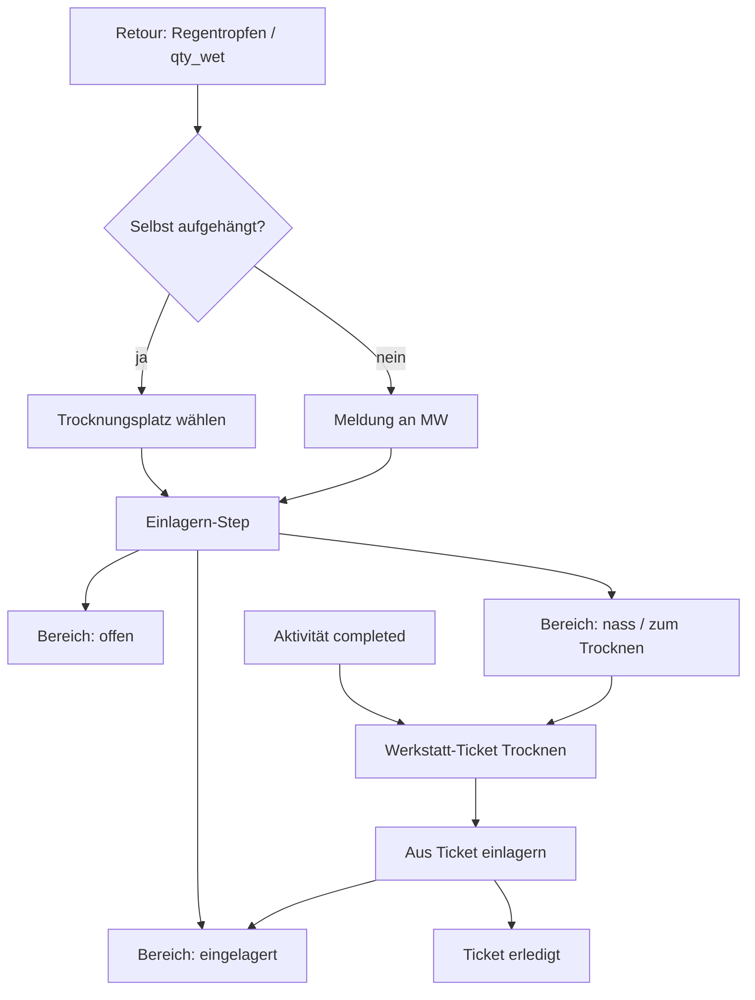

# Arbeitspaket: Legacy-Sheet-Features (Pfadimaterial 3.0 → eMatChef)

Übernahme von **Funktionen / UX-Mustern** aus der alten Google-Mappe *[Pfadimaterial 3.0](https://docs.google.com/spreadsheets/d/1iDRlGIYv-SwelpYet2xeI2UMvBcI1WsGHqR9cYfb19w/edit?usp=sharing)* — nicht nur Stammdaten-Import.

**Stand:** August 2026  
**Stichtag Betriebsstart:** «heute» = ab eMatChef-Betrieb; Historie davor manuell nachführbar  
**Status:** **A** (Nass) A1–A6 komplett · **B** (Esswaren) Kern umgesetzt · Abnahme A/B offen · als Nächstes **C** Historie

> Nummerierung = Buchstaben aus **Ziel (Kurz)** (A = Nass, B = Esswaren, …). Nicht mit alten «Phase 1/2»-Nummern verwechseln.

**Verwandt:** [activities/newUI/SPEC.md](../activities/newUI/SPEC.md) · [activities/material-pipeline.md](../activities/material-pipeline.md) · [workshop/](../workshop/README.md) · [accounting.md](../accounting.md) · [material/combos/](../material/combos/README.md) · [future/ideen-backlog.md](../future/ideen-backlog.md)

---

## Ziel (Kurz)

| # | Thema | Alter Sheet | Ziel in eMatChef |
|---|--------|-------------|------------------|
| A | Nass/feucht bei Retour | Ausleih Zelt «nass» | `qty_wet` + Trocknungs-Warteschlange im Einlagern-Step |
| B | Esswaren nach Verfall | Essen «Tage bis Verfall» | Sortierung + Filter; Artikel + Chargen als Sub |
| C | Zelt-Kombi Historie | Repratur Zelt + Ausleih Zelt | Reparatur-Log + Verleih-Historie in Material-Detail |
| D | Rabatte nach Mietertyp | Preisliste | Accounting; nur externe Miete; Adresse/Leiter |
| E | Verkleidung & Requisiten | eigener Sheet | Tab + `is_costume` + Grösse/Details |
| F | Historie vor Stichtag | alte Logs | Manuelles Nachführen von Ausleihen/Reparaturen |

**Nicht in diesem Paket:** Vollimport Inventar/Essen/Zeltliste als Datenmigration (eigenes Import-Arbeitspaket).

---

## Entschieden (2026-08-10)

### A — Nass / Trocknen / Einlagern

| ID | Entscheidung |
|----|----------------|
| **A1** | **`qty_wet` + Trocknungs-Warteschlange** im **Einlagern-Step** — kein eigener Journey-Status. Einlagern hat **drei Bereiche**: (1) offen / noch einlagern, (2) bereits eingelagert, (3) **nass / zum Trocknen**. |
| **A2** | Aktivität **darf `completed`** werden. Dabei entsteht ein **Werkstatt-Ticket** «Trocknen/Einlagern nass». Die Einlagerung der Aktivität gilt als **kontrolliert, aber nicht abgeschlossen**, bis die nassen Mengen **aus dem Ticket** eingelagert sind — erst dann Ticket **erledigt**. |
| **A3** | **Trocknungsplatz** als wählbarer **Lagerort** (Hauptlager + sonstige Lagerplätze / Trockenplätze). |
| **A4** | Beim Melden «nass»: Wahl **«schon selbst aufgehängt»** vs. **«muss noch aufgehängt werden»**. Bei selbst aufgehängt → **Standort(e) zum Trocknen** angeben. |
| **A5** | **Kein Foto** bei Nass. **Meldung an MW nur**, wenn nass **und nicht** aufgehängt. |
| **A6** | Gilt für Materialien mit Regentropfen-Toggle bei Retour (Teilmenge `qty_wet`); trockener Rest kann normal verräumt werden. |

### B — Esswaren

| ID | Entscheidung |
|----|----------------|
| **B1** | Listenzeile = **Artikel**; **Chargen als Sub-Zeilen** (Expand wie Kombi-Komponenten). Sortierung nach **frühestem** Verfall des Artikels. |
| **B2** | Filter: Alle / bald (Chips 7/14/30, Default 30) / abgelaufen / ohne Datum. |

### C — Historie Detail

| ID | Entscheidung |
|----|----------------|
| **C1** | Historie für **alle Materialien** (bei Zelt/Combos besonders sichtbar). |
| **C2** | Reparaturen = Werkstatt-Tickets + manuelle Legacy-Einträge (F). Nass-Trocknen-Tickets erscheinen hier ebenfalls. |

### D — Rabatte

| ID | Entscheidung |
|----|----------------|
| **D1** | Konfiguration in **Accounting / Finanzen** (department-weit). |
| **D2** | Auswahl **nur bei externer Vermietung**. |
| **D3** | Ist die Mieter-Adresse ein **interner Leiter**, gilt der **gewählte Mietertyp-Rabatt** für diese Buchung (vorausgefüllt, überschreibbar). |

### E — Verkleidung

| ID | Entscheidung |
|----|----------------|
| **E1** | Flag **`is_costume`** analog `is_food`. |
| **E2** | Gleicher Tab für Kleidung & Requisiten; Feld **Art** möglich. |
| **E3** | **Kleidergrösse** + **Details** erfassbar (Freitext / Detailfelder in angepasster Detailansicht). |

### F — Legacy-Log

| ID | Entscheidung |
|----|----------------|
| **F1** | Department-Setting Stichtag; davor manuell nachführbar. |
| **F2** | CSV-Import Alt-Logs = Follow-up, nicht MVP von **F**. |

---

## Empfohlene Reihenfolge

Reihenfolge folgt den Buchstaben aus **Ziel (Kurz)** (A zuerst).

| # | Paket | Warum | Aufwand |
|---|-------|-------|---------|
| **A** | **Nass / Trocknen / Ticket** | Kern-MW; Einlagern + Werkstatt | L |
| **B** | **Esswaren Verfall** | Klarer Scope | S–M (Expand-Chargen) |
| **C** | **Historie Detail** | Lesen + Anbindung | M |
| **D** | **Mietertyp-Rabatte** | Accounting + external | M |
| **E** | **Verkleidung-Tab** | Flag + Detail | M |
| **F** | **Legacy-Log manuell** | nach C | S–M |

---

## A — Retour Nass → Einlagern-Warteschlange → Werkstatt-Ticket

**Ist:** Kein Feuchtigkeits-Flag; Einlagern nur offen vs. eingelagert.

### Flow (Soll)

### Done when

**Retour**

- [x] Regentropfen-Toggle; **Teilmenge** `qty_wet` (Rest trocken)
- [x] Dialog/Choice: **schon aufgehängt** | **muss noch aufgehängt werden**
- [x] Wenn aufgehängt: **Lagerort Trocknung** wählbar (Hauptlager + sonstige / Trockenplätze)
- [x] Wenn **nicht** aufgehängt: **Inbox-Meldung an MW** (kein Foto)
- [x] Trockener Anteil geht normal in Retour → Einlagern

**Einlagern-Step — drei Bereiche**

- [x] (1) **Offen** — noch verräumen
- [x] (2) **Eingelagert** — erledigt
- [x] (3) **Nass / zum Trocknen** — `qty_wet` / Trocknungs-Warteschlange (sichtbar, nicht «vergessen»)

**Abschluss & Werkstatt**

- [x] Aktivität darf **`completed`** trotz offener Trocknung (wet zählt nicht als Dry-Blocker)
- [x] Beim Abschluss: **Werkstatt-Ticket** Typ Cleaning Trocknen–Einlagern
- [x] Ticket erst **erledigt**, wenn nasse Artikel eingelagert sind (`from_wet` / store-from-wet)
- [x] Historie: Nass-Flag, aufgehängt ja/nein, Trocknungsort, Ticket-Link (Felder + Ticket-Beschreibung)

**Sonstiges**

- [x] i18n DE (+ EN Store/Retour-Keys)
- [x] Lose Retour: Regentropfen wie Kiste (A6)
- [x] A4: Trocknungsort Pflicht wenn aufgehängt (FE+BE)
- [x] MW-Inbox: kein Spam bei wiederholtem Nass-Post
- [x] Nach Complete: Nass-Warteschlange bleibt bedienbar; Werkstatt-Link zur Queue
- [ ] Optional Department-Defaults für Trockenplätze
- [x] Manuelle Abnahme: [legacy-a-nass-abnahme.md](./legacy-a-nass-abnahme.md) (Fadä 11.08.2026)

### Anknüpfung

- Journey Einlagern [SPEC §7.6](../activities/newUI/SPEC.md#76-materialstoreshelvesheet-einlagern)
- Pipeline: `qty_wet` / drying-State neben `quantity_returned` / `quantity_stored`
- [workshop/](../workshop/README.md) — neuer Ticket-Anlass oder Typ «Trocknen»
- [nachrichtenzentrale.md](../nachrichtenzentrale.md) — MW-Meldung nur «nass + nicht aufgehängt»

### Akzeptanz

10 retour, 3 nass nicht aufgehängt → MW-Meldung; 7 unter Offen/Eingelagert verräumbar; 3 unter «Nass/Trocknen»; Aktivität abschliessbar → Ticket offen; nach Trocknen Einlagern aus Ticket → Ticket erledigt.

---

## B — Esswaren: Verfall oben + Filter + Chargen-Sub

**Ist:** `expiry_date` auf Charge; Tab `esswaren`; keine Verfall-Sortierung/-Filter; keine Sub-Chargen in der Liste.

### Done when

- [x] Tab **Esswaren**: Default-Sort = **nächstes Ablaufdatum zuerst** (Artikel-Aggregation = min. Chargen-Datum; ohne Datum ans Ende)
- [x] Spalten: **Ablaufdatum** (frühestes) und **Tage bis Verfall** (negativ = abgelaufen)
- [x] Filter: Alle · Bald (7 / 14 / **30** Default) · Abgelaufen · Ohne Datum
- [x] Sortier-Toggle: Name, Bestand, Verfall (Default Verfall)
- [x] **Expand** wie Kombos: Unterzeilen = **Chargen** mit je eigenem Ablauf / Menge / Standort
- [x] Mobile: gleiche Semantik
- [x] i18n DE/EN

### Anknüpfung

- `MaterialsView.vue`, `MaterialListDataTable.vue` / `MaterialListMobile.vue`
- API: `nearest_expiry_date` in Listen-Serialize; `GET /api/materials/{id}/batches` für Expand
- Util: `frontend/src/utils/materialExpiry.ts`

### Akzeptanz

Artikel «Reis» oben wegen Charge A (bald); Expand zeigt Charge A + B mit jeweiligen Daten.

---

## C — Detailansicht: Reparatur-Log + Verleih-Historie

### Done when

- [ ] Material-Detail: Abschnitt **Reparaturen** (Datum, Teil, Text, Kosten, Quelle Ticket/manuell; inkl. Trocknen-Tickets)
- [ ] Abschnitt **Verleih-Historie** (Aktivität/Anlass, Zeitraum, **Tage**, Menge, Profil)
- [ ] Betrieb ab Stichtag aus echten Daten; Legacy aus F
- [ ] Alle Materialien; Leerzustand + Pagination

### Akzeptanz

Spatz-Maxi → letzte Ausleihen mit Tagen + Reparaturen/Kosten.

---

## D — Mietertyp-Rabatte (Accounting, nur external)

### Done when

- [ ] Accounting: **Mietertypen** + Default-Rabatt-%
- [ ] Nur bei Aktivität **`external`**: Mietertyp wählbar → Rabatt vorausgefüllt, überschreibbar
- [ ] Mieter-Adresse = **interner Leiter** → gewählter Rabatt greift für die Buchung
- [ ] Kosten-/Rechnungspfad nutzt denselben Rabatt
- [ ] Rechte MW/DC; Doku in [accounting.md](../accounting.md)

### Akzeptanz

External + Leiter-Adresse + Typ «Gemeindeverein» → 30 % vorausgefüllt.

---

## E — Tab «Verkleidung & Requisiten»

### Done when

- [ ] Flag **`is_costume`**
- [ ] Tab analog Esswaren
- [ ] Detail: **Kleidergrösse**, **Details**, Farbe, Beschreibung, Lagerort, aktueller Ausleih-Status
- [ ] Feld **Art** (Kleidung / Requisite / Maske / …) — mindestens als Freitext oder Select
- [ ] Ausleihe nur über Aktivitäten
- [ ] Filter verfügbar / ausgeliehen
- [ ] Create-Wizard Vorbelegung im Tab
- [ ] i18n

### Akzeptanz

Mantel nur im Verkleidung-Tab; Detail zeigt Grösse/Details und ob draussen.

---

## F — Manuelle Historie vor Stichtag

### Done when

- [ ] Department-Setting `legacy_history_cutoff`
- [ ] Manuelle historische Reparatur / Ausleihe ohne Pipeline-Buchung
- [ ] `source: legacy_manual`; sichtbar in C-Historie
- [ ] Kein Bestands-/Pipeline-Side-Effect
- [ ] CSV-Import = späteres Follow-up

### Akzeptanz

«Firstriss 2011» / «SoLa 2020» manuell → in Detail-Historie, Bestand unverändert.

---

## Ergänzungen / Ideen (nicht Kern)

| Idee | Status |
|------|--------|
| Foto bei Nass | **Verworfen** |
| MW-Meldung nur «nass + nicht aufgehängt» | **Kern A** |
| Trocknungsplatz als Lagerort | **Kern A** |
| Esswaren-Inbox ≤ 14 Tage | Optional Follow-up |
| Verkleidung Grössen-Filter | Optional nach E |
| Abschreibungs-Kalkulator Widget | Optional Accounting |
| Zelt-Häringe als Combo-BOM | Eigenes Mini-Paket |
| Devices: Regentropfen am Handheld | Später Parität |

---

## Abgrenzung

| Drin | Raus |
|------|------|
| UX/Funktionen oben | Massen-Import Inventar-CSV |
| Manuelle Historie vor Stichtag | Full-Sheet-Parser aller Tabs |
| Mietertyp-Rabatte in Accounting | Vereins-Fibu / Bexio |
| Verkleidung-Tab | Separates Kostüm-Portal |

---

## Fortschritt

| # | Status | Notizen |
|---|--------|---------|
| **A** Nass / Trocknen | **A1–A6 fertig + Abnahme ok** | Optionale Dept-Defaults offen |
| **B** Esswaren Verfall | **umgesetzt** | `nearest_expiry_date` + Filter/Sort/Expand |
| **C** Historie Detail | offen | |
| **D** Mietertyp-Rabatte | offen | D1–D3 entschieden |
| **E** Verkleidung-Tab | offen | E1–E3 entschieden |
| **F** Legacy-Log manuell | offen | nach C |

---

## Changelog

| Datum | Änderung |
|-------|----------|
| 2026-08-10 | Erstfassung |
| 2026-08-10 | Entscheidungen A–E fest: Einlagern-3-Bereiche, Completed+Werkstatt-Ticket, Esswaren Expand-Chargen, `is_costume`+Grösse, Rabatte Accounting/external/Leiter; kein Nass-Foto; MW-Meldung nur wenn nicht aufgehängt |
| 2026-08-10 | **A** Kern: `quantity_wet` + Metadaten, Wet-API, Pipeline/Abschluss, Cleaning-Tickets, Retour-Regentropfen, Einlagern-Sektion «Nass», `from_wet` Einlagern |
| 2026-08-11 | **A** A1–A6 komplett: Lose-Retour-Nass, Trocknungsort-Pflicht, Notify-Dedupe, Wet-UI bis nach Complete, Werkstatt→Queue |
| 2026-08-11 | **B** Esswaren: `nearest_expiry_date`, Filter bald/abgelaufen, Sort Verfall, Chargen-Expand |
| 2026-08-11 | Doku: Phasennummern an Buchstaben A–F aus Ziel (Kurz) angeglichen (A = Nass) |
