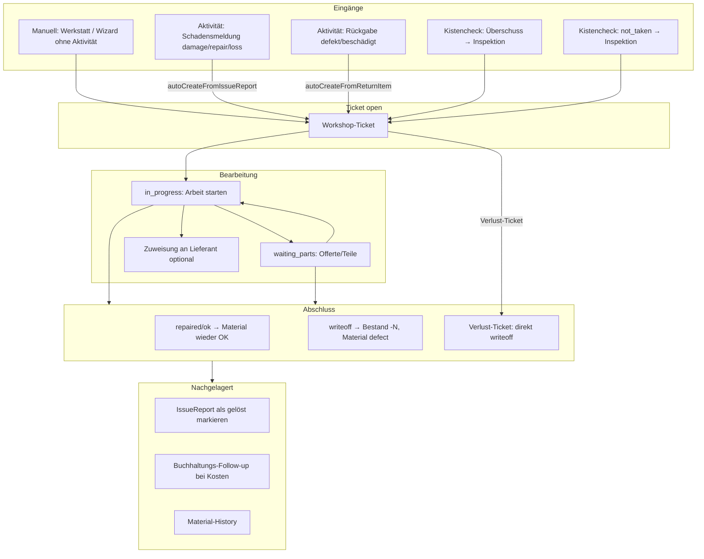

# Werkstatt (Workshop)

Dokumentation zum **Werkstatt-Workflow** in eMatChef: Ticket-Lebenszyklus, Eingänge, Abschluss, Integrationen und Verbesserungsvorschläge.

**Stand:** Juni 2026

| Datei | Inhalt |
|--------|--------|
| **[materialwart-workflow2026.md](./materialwart-workflow2026.md)** | Ziel-Workflow Materialwart 2026 (Spezifikation) |
| **[plan.md](./plan.md)** | Umsetzungsplan: 22 Pakete, Wellen W1–W9, Checklisten |

---

## Verwandte Docs

| Thema | Ort |
|--------|-----|
| Aktivitäten (Meldungen, Rückgabe) | [docs/activities/](../activities/) |
| Buchhaltung / Follow-ups | [accounting.md](../accounting.md) |
| Lieferanten-Portal (Reparaturen) | [docs/supplier/supplier-portal.md](../supplier/supplier-portal.md) |
| Öffentliche QR-Seiten | [docs/qr/qr-public-pages.md](../qr/qr-public-pages.md) |
| Medien / Fotos | [docs/media/README.md](../media/README.md) |

---

## Relevante Code-Stellen

| Bereich | Pfad |
|---------|------|
| Entity | `backend/src/Entity/WorkshopTicket.php` |
| API | `backend/src/Controller/WorkshopController.php` |
| Auto-Erstellung (Aktivität) | `backend/src/Controller/ActivityWorkflowController.php` |
| Frontend | `frontend/src/views/WorkshopView.vue` |
| API-Client | `frontend/src/api/workshop.ts` |
| Schadensmeldungs-Wizard | `frontend/src/components/DamageReportWizard.vue` |
| Lieferanten-Sicht | `backend/src/Service/Supplier/SupplierRepairTicketService.php` |
| Buchhaltung | `backend/src/Service/ActivityAccountingCostService.php` |

---

## Aktueller Stand: Was existiert?

Die Werkstatt ist ein **Ticket-System** (`WorkshopTicket`) mit eigener Ansicht, History, Statistiken und Anbindung an Aktivitäten, Material, Buchhaltung und externe Lieferanten.

### Kern-Datenmodell

| Dimension | Werte |
|-----------|-------|
| **Typen** | `repair`, `inspection`, `writeoff`, `cleaning` |
| **Prioritäten** | `low`, `normal`, `high`, `urgent` |
| **Status** | `open` → `in_progress` → `waiting_parts` → `completed` / `cancelled` |
| **Abschluss-Ergebnis** | `repaired`, `ok`, `writeoff` |

### Erlaubte Status-Übergänge

```
open           → in_progress, cancelled
in_progress    → waiting_parts, completed, cancelled
waiting_parts  → in_progress, cancelled
completed      → (Endzustand)
cancelled      → open  (Wiedereröffnen)
```

Definiert in `WorkshopTicket::STATUS_TRANSITIONS`.

### UI & Oberflächen

- **Werkstatt-Ansicht** (`WorkshopView`): Kanban + Tabelle, Filter (Typ, Quelle, Priorität), Schnellfilter für Offerten/Preise bei externen Aktivitäten
- **Dashboard-Widget** für Materialwart/Depotchef: offene Tickets, Offerten offen, fehlende Preise
- **Material-Detail**: Tab mit allen Tickets zu einem Material
- **Schadensmeldungs-Wizard** (`DamageReportWizard`): mit oder ohne Aktivität
- **Lieferanten-Portal** (`SupplierRepairsView`): zugewiesene Reparaturen bearbeiten
- **Öffentliche QR-Seite** + **Abteilungs-Display**: Ticket-Info für Helfer/Gäste

### Weitere Felder (Stand Juni 2026)

| Feld | Zweck |
|------|-------|
| `material_batch_id` | Konkrete Seriennummer/Charge bei serialisiertem Material |
| `affected_quantity` | Betroffene Menge bei Bulk-Material (Teilmengen) |
| `assigned_to_supplier_company_id` | Zuweisung an externen Reparatur-Lieferanten |
| `estimated_cost` / `actual_cost` | Kostenvoranschlag und Ist-Kosten |
| `parts_used` | Verwendete Ersatzteile (JSON, Backend vorhanden) |
| `photos` | Ticket-Fotos (Upload über Media-System) |

---

## Ablauf im Detail



### 1. Ticket-Erstellung (5 Wege)

#### a) Manuell

- Button „Neues Ticket" in der Werkstatt
- Schadensmeldungs-Wizard **ohne Aktivität** → direkt `createWorkshopTicket`
- Bei serialisiertem Material: `material_batch_id` Pflicht
- Bei Bulk-Material: `affected_quantity` (Standard 1)

#### b) Aus Aktivitäts-Meldungen (automatisch)

Bei `repair`, `damage`, `loss` wird beim Erstellen eines `ActivityIssueReport` automatisch ein Ticket erzeugt (`WorkshopController::autoCreateFromIssueReport`):

| Meldungstyp | Ticket-Typ | Priorität |
|-------------|-----------|-----------|
| `damage` | `repair` | hoch |
| `repair` | `repair` | normal |
| `loss` | `writeoff` | normal |
| `not_taken` | `inspection` | normal |

`consumption` erzeugt **kein** Werkstatt-Ticket (nur Buchhaltung).

Material-Stamm wird bei voller Betroffenheit angepasst:
- `loss` → `condition = lost`
- `repair` / `damage` → `condition = repair`

#### c) Aus Rückgabe (automatisch)

Wenn bei der Rückgabe `condition_in = defekt` oder `beschaedigt`, wird ein Reparatur-Ticket erstellt (`autoCreateFromReturnItem`) — sofern noch kein offenes Ticket für dasselbe Material + Aktivität existiert.

Material-Zustand:
- `defekt` → `condition = defect`
- `beschaedigt` → `condition = repair`

#### d) Aus Kistencheck

- **Überschuss** → Inspektions-Ticket (`autoCreateInspectionForCrateCheckSurplus`)
- **`not_taken`** → Inspektions-Ticket (kein Lagerverlust, Lager-Kontrolle)

### 2. Bearbeitung in der Werkstatt

Typischer Happy Path:

1. **Offen** → „Arbeit starten" → `in_progress` (setzt `started_at`)
2. Optional: **„Wartet auf Teile"** → `waiting_parts` (Offerte/Kostenvoranschlag)
3. **„Abschließen"** → Dialog mit Ergebnis + Kosten + Notizen

**Sonderfall Verlust:** Tickets aus `loss`-Meldungen können direkt von `open` über „Verlust annehmen" abgeschlossen werden (ohne `in_progress`).

**Externe Aktivitäten** (Vermietung) — strengere Regeln:

- Vor `waiting_parts`: `estimated_cost` Pflicht
- Vor Abschluss bei `repaired`/`writeoff`: `actual_cost` Pflicht

Dashboard-Schnellfilter: `qf=waiting_quote` und `qf=missing_estimated_cost`.

### 3. Abschluss — Systemwirkung

| Ergebnis | Material-Stamm | Serialisiert (Batch) | Bestand |
|----------|---------------|---------------------|---------|
| `repaired` / `ok` | `condition → ok` | Batch-Status → `active` | unverändert |
| `writeoff` | `condition → defect` | — | Writeoff-Batch mit `-qty` |

Zusätzlich beim Abschluss (`WorkshopController::transition`):

- Verknüpfter **IssueReport** wird als `resolved` markiert
- Bei Aktivitätsbezug: **Buchhaltungs-Follow-up** wird enqueued (`ActivityAccountingCostService::enqueueFromWorkshopTicket`)
- Eintrag in **WorkshopTicketHistory** und ggf. **MaterialHistory**

Bei manueller Ticket-Erstellung vom Typ `repair`:
- Serialisiert: Batch-Status → `defect`
- Bulk: Stamm → `repair`, wenn `affected_quantity >= total_stock`

### 4. Aktivitäts-Abschluss vs. Buchhaltung

**Ist (Phase 1):** Aktivität blockiert **nicht** mehr bei offenen Werkstatt-Tickets / pending Buchhaltung — nur bei fehlender Material-Disposition (`unstored_pack_items`).

**Modell** ([accounting.md — Zwei Abschlüsse](../accounting.md#zwei-abschlüsse-kernmodell)): Aktivität `completed`, sobald Material geklärt ist (eingelagert oder Verlust/Reparatur **gemeldet**). Offene Tickets blockieren den Aktivitäts-Abschluss **nicht**. Effektive Kosten → Follow-up erst nach Ticket-Abschluss mit `actual_cost`. In der Buchhaltung erscheinen offene Tickets als Vorschau **«Kosten folgen»** (Phase 5, [accounting.md](../accounting.md#buchhaltung-kosten-folgen-offene-werkstatt)).

---

## Was funktioniert schon gut

1. **Klare Status-Maschine** mit validierten Übergängen
2. **Automatische Ticket-Erstellung** aus dem Aktivitäts-Alltag (Meldung, Rückgabe, Kistencheck)
3. **Herkunftstracking** über History + IssueReport-Verknüpfung
4. **Externe-Vermietung-Flow** mit Offerte/Ist-Preis und Dashboard-Schnellfiltern
5. **Lieferanten-Zuweisung** für externe Reparaturen
6. **Material-Rückwirkung** bei internem Abschluss (Zustand, Bestand, History)
7. **Buchhaltungs-Anbindung** pro abgeschlossenem Ticket mit Kosten
8. **Teilmengen und Seriennummern** bei manueller Erstellung (Migrationen Juni 2026)

---

## Bekannte Lücken & Verbesserungsvorschläge

### Phase 1 — Lücken schliessen (hoher Impact)

#### 1. Lieferanten-Abschluss ist unvollständig

Wenn ein Lieferant ein Ticket über das Portal abschliesst (`SupplierRepairTicketService::transitionTicket`), werden nur Status und Kosten gesetzt — **nicht**:

- Material-Zustand / Writeoff-Batch
- IssueReport als gelöst
- Buchhaltungs-Follow-up

→ Gemeinsame Abschluss-Logik mit `WorkshopController::transition()` extrahieren (z. B. `WorkshopTicketCompletionService`).

#### 2. Keine Zuweisung an interne Mitarbeiter in der UI

Die API unterstützt `assigned_to_user_id`, aber in `WorkshopView` gibt es nur Lieferanten-Zuweisung. Fehlend:

- Dropdown „Zuständig"
- Filter „Meine Tickets"
- Benachrichtigung bei Zuweisung

#### 3. Herkunft `return_item` ist in der UI unsichtbar

Tickets aus Rückgabe haben `origin_source: 'manual'`, weil nur `issue_report_id` geprüft wird. In der History steht `source: return_item`, aber Filter und Badges zeigen das nicht.

→ `origin_source` um `'return_item'` erweitern.

#### 4. Auto-Erstellung nutzt neue Felder noch nicht vollständig

`autoCreateFromIssueReport` und `autoCreateFromReturnItem` setzen weder `material_batch_id` noch `affected_quantity` bei Teilmengen. Die Migrationen Juni 2026 sind primär für manuelle Erstellung verdrahtet.

#### 5. Keine Benachrichtigung an die Werkstatt

Bei IssueReports gibt es Inbox-Nachrichten (`notifyActivityIssueReported`), für neue Werkstatt-Tickets aber nichts. Materialwart erfährt vom Ticket erst über Dashboard oder wenn er aktiv in die Werkstatt schaut.

### Phase 2 — Alltag verbessern (mittlerer Impact)

#### 6. Kanban ohne Drag & Drop

Spalten sind rein visuell; Statuswechsel nur über Detail-Dialog-Buttons.

#### 7. Typ-spezifische Workflows

Alle Typen durchlaufen denselben Status-Flow. Sinnvoller wäre:

- **Inspektion:** vereinfachter Pfad (oft direkt `ok`/`writeoff`)
- **Reinigung:** eigener Abschluss ohne Kostenpflicht
- **Abschreibung:** direkter Writeoff-Flow ohne „Arbeit starten"

#### 8. `parts_used` ohne UI

Ersatzteile werden im Backend gespeichert, aber nirgends erfasst oder angezeigt.

#### 9. Doppel-Tickets vermeiden

- IssueReport: Dedupe per `issue_report_id` ✓
- Rückgabe: Dedupe per Material + Aktivität (nicht per ReturnItem)
- Meldung **und** Rückgabe für dasselbe Material können zwei Tickets erzeugen

→ Intelligentes Merging oder Hinweis „Ticket bereits vorhanden".

#### 10. Aktivitäts-Abschluss-Blocker sichtbarer machen

Aus der Werkstatt heraus fehlt direkter Kontext: „Diese Aktivität wartet auf dich" mit Link zurück zur Aktivität.

### Phase 3 — Prozess (strategisch)

| Idee | Beschreibung |
|------|--------------|
| **Triage-Stufe** | Status `triage` oder Inbox „Neu eingegangen" vor `open` |
| **SLA & Alterung** | Fristen, Farbcodierung nach Wartezeit, Eskalation bei `urgent` |
| **Inspektions-Queue** | Eigene Warteschlange für Kistencheck/`not_taken`-Tickets |
| **Rückmeldung an Melder** | Benachrichtigung wenn Ticket abgeschlossen |
| **Mobile Werkstatt-Modus** | Foto + Status + Abschluss in wenigen Klicks |
| **Einkauf an `waiting_parts`** | Link zu Beschaffung oder Checkliste „Teil bestellt / eingetroffen" |

---

## Empfohlene Umsetzungsreihenfolge

| Phase | Fokus | Warum zuerst |
|-------|-------|--------------|
| **1 — Lücken** | Lieferanten-Abschluss, `origin_source`, Auto-Create mit `affected_quantity`/`batch` | Datenkonsistenz, keine stillen Fehler |
| **2 — Alltag** | Interne Zuweisung, Benachrichtigungen, Drag & Drop, `parts_used`-UI | Werkstatt-Team arbeitet schneller |
| **3 — Prozess** | Typ-spezifische Flows, Triage, SLA, Inspektions-Queue | Strukturelle Verbesserung |

---

## Kurzfassung

**Heute:** Die Werkstatt ist ein solides Ticket-System mit guter Anbindung an Aktivitäten, Material und Buchhaltung. Tickets entstehen automatisch aus dem Lager-Alltag, werden in Kanban/Tabelle bearbeitet, und beim Abschluss wirken sie auf Bestand, Materialzustand und Abrechnung zurück. Aktivitäten können erst abgeschlossen werden, wenn alle Werkstatt-Tickets erledigt sind.

**Schwachstellen:** Lieferanten-Abschluss ohne Seiteneffekte, keine interne Zuweisung/Benachrichtigung, unvollständige Herkunftskennzeichnung, neue Teilmengen-/Seriennummer-Logik nur manuell, ein generischer Workflow für alle Ticket-Typen.
